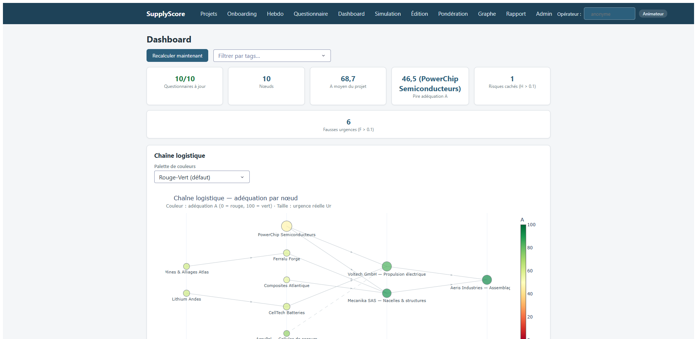

# SupplyScore

   

SupplyScore transforme des données supply chain en un score d'alignement entre le besoin
déclaré et la réalité opérationnelle, sur une chaîne multi-rangs (client final au rang 0,
fournisseurs profonds au rang N).

- Ud, urgence déclarée : questionnaire humain hebdomadaire (AHP, Saaty 1977, CR < 0.10).
- Ur, urgence opérationnelle réelle : modélisée depuis les KPIs (temps, capacité, OEE,
  risque, coût, CO2), modulée par l'avancement des jalons ; poids des blocs pilotables par
  projet (FBWM).
- A, adéquation Ud/Ur : pénalité asymétrique Prospect Theory (Kahneman-Tversky) ; le risque
  caché H (sous-estimation) est pénalisé plus fort que la fausse urgence F (sur-estimation).
- Propagation sur DAG : le besoin déclaré descend (rang 0 → N), le risque réel remonte
  (rang N → 0) ; les statuts de tâche (terminée, abandonnée) propagent leur choc sur toute
  la chaîne.



## Démarrage rapide

```powershell
# installer (une fois) : crée .venv et installe tout depuis uv.lock
.\scripts\Installer.ps1            # ou : $env:UV_LINK_MODE='copy'; uv sync

# lancer avec des données de démonstration (TEST uniquement, générées aléatoirement)
.venv\Scripts\supplyscore.exe --demo --open-browser

# -> http://127.0.0.1:8050
```

Sans console : un double-clic sur `scripts\SupplyScore.bat` lance le même serveur et ouvre
le navigateur.

## La commande supplyscore

`supplyscore` (équivalent : `python -m supplyscore.cli`) lance le serveur web local
sur 127.0.0.1. Les bases SQLite vivent par défaut dans
`%LOCALAPPDATA%\SupplyScore\data`, hors dossier synchronisé cloud ; `--db-dir` les place
ailleurs, et `--migrate-data` déplace un `data_store/` hérité vers l'emplacement par défaut
après une sauvegarde zip de sécurité. `--demo` peuple une base vide avec un projet de test
aléatoire, `--port` change le port d'écoute (8050 par défaut), `--debug` active le
rechargement à chaud de Dash, `--log-level` et `--log-dir` règlent la journalisation. À
chaque démarrage, une sauvegarde automatique est créée si la plus récente a plus de 24 h
(rétention : 20 archives), sauf si `--no-backup` est posé ; une base corrompue bloque le
lancement avec le code de sortie 2. `--open-browser` ouvre le navigateur une fois le
serveur démarré. Chaque option est détaillée dans la [référence CLI](docs/reference_cli.md).

## Serious game

SupplyScore est conçu pour animer un serious game sur un poste unique : un projet en mode
« temps de jeu », un joueur par nœud de la chaîne (opérateurs identifiés), des tours d'une
semaine simulée (« Avancer d'une semaine »). Chaque tour, chaque joueur déroule sa revue
hebdomadaire en 4 volets (AHP, KPIs, jalons, événements et décision) ; l'animateur suit les
scores au dashboard, puis clôture par l'export xlsx, le rapport de session (avec
calibration prédiction/réalité) et une sauvegarde. Le parcours complet est documenté pas à
pas dans le [manuel utilisateur](docs/manuel_utilisateur.md) (chapitre « Animer un serious
game ») et prouvé par `tests/test_jalon1_session.py`.

## Les 13 pages

| Page | Rôle |
|---|---|
| Projets (`/`) | Créer ou sélectionner un projet, ajouter des nœuds, statuts de tâche, horloge réel/jeu (« Avancer d'une semaine »), paramètres du calcul (u_time analytique ou Monte Carlo), export xlsx et sauvegarde |
| Onboarding (`/onboarding`) | Wizard 4 sections (identité, cahier des charges, KPIs, première évaluation AHP) ; brouillon persisté en base et repris |
| Hebdo (`/hebdo`) | Revue hebdomadaire guidée d'un nœud en 4 volets : AHP pré-rempli, diff KPI, jalons, événements calibrés et décision tracée |
| Questionnaire (`/questionnaire`) | Mode expert : comparaisons AHP par paires, notes des 4 critères, saisie des KPIs ; calcule Ud en direct avec contrôle de cohérence (CR) |
| Dashboard (`/dashboard`) | DAG coloré par adéquation A, badges hebdo, priorités PROMETHEE II, tableau détaillé Ud/Ur/A/F/H, évolution temporelle, lien « Expliquer » par nœud |
| Simulation (`/simulation`) | What-if sans persistance : choc unitaire, scénarios composites multi-chocs, criticité systématique (tornado), scénarios enregistrés |
| Édition (`/edition`) | Tableau éditable des KPIs courants (filtres projet/bloc/tags), validation, audit et recalcul à chaque cellule |
| Pondération (`/ponderation`) | Questionnaire FBWM (2n−3 comparaisons) : poids des blocs KPI d'Ur par projet et semaine, cohérence ξ*/CR en direct |
| Graphe (`/graphe`) | Éditeur de structure : arcs (γ/β/δ, nominal/backup), anti-cycle, taxonomie des tags, statuts |
| Rapport (`/rapport`) | Rapport de session HTML autonome : évolution des scores, chronologie événements/décisions, calibration prédiction/réalité |
| Admin (`/admin`) | Données brutes des tables SQLite : lecture seule par défaut, édition déverrouillable et auditée, tables d'historique inéditables |
| Fiche nœud (`/node/<id>`) | Vue 360° rééditable par section : identité, cahier des charges versionné, jalons, KPIs, évaluations, événements, journal d'audit |
| Explication (`/node/<id>/explication`) | « Pourquoi ce score ? » : décomposition exacte de Ud, d'Ur (part locale vs propagée) et de l'équation d'adéquation |

## Architecture

```
supplyscore/
  domain/    modèles partagés : SupplyNode, SupplyArc, KPIBundle, Project, AHPAssessment,
             UrgencyState, Milestone, événements calibrés, cahier des charges, tags, validation
  core/      AHP -> Ud · UrModel (6 blocs KPI + OR probabiliste pondéré) -> Ur ·
             AdequationEngine -> A, F, H · horloge bimodale (réel/jeu) · explicabilité exacte
  graph/     GraphRepository (interface) · InMemoryGraphRepository (networkx) ·
             Neo4jGraphRepository (option) · PropagationEngine (complet + incrémental) · scénarios
  mcda/      FBWM (pondération floue des blocs Ur) · PROMETHEE II (classement des nœuds)
  mc/        Monte Carlo lead time (PERT stochastique propagé sur le DAG)
  data/      RegistryDatabase (graphe partagé) · ClientDatabase (une base SQLite PAR nœud) ·
             migrations versionnées (PRAGMA user_version) · audit append-only · sauvegarde/restauration
  services/  SupplyScoreService (façade) · MutationService (toute écriture auditée) · onboarding ·
             hebdo · événements · décisions · exports · calibration · rapport · criticité
  infra/     journalisation rotative · emplacements de données (platformdirs)
  tools/     restauration en ligne de commande (python -m supplyscore.tools.restore)
  web_ui/    application Dash (factory create_app, 13 pages, callbacks protégés, composants réutilisables)
  cli.py     point d'entrée : la commande supplyscore (build_parser, main)
run_app.py   wrapper hérité, réexporte main et resolve_db_dir depuis supplyscore.cli
tests/       tests unitaires et d'intégration, propriétés Hypothesis, bancs de performance, navigateur
```

L'organisation des packages, la façade `SupplyScoreService`, le chemin d'écriture audité et
les points d'extension sont décrits dans [le guide développeur](docs/guide_developpeur.md).

## Modèle mathématique

1. Ud local : AHP 4 critères (impact opérationnel, fenêtre temporelle, dépendances aval,
   récupérabilité) ; Ud = (Σ wᵢ·sᵢ − 1)/8 ∈ [0,1] ; lissage EMA entre semaines (ρ = 0.3).
2. Ur local : u_time (probabilité de retard P(L > d−t) sur le prochain jalon actif, modulée
   par l'avancement déclaré vs théorique, ou Monte Carlo propagé sur le DAG au choix du
   projet), u_cap, u_perf (1−OEE), u_risk (enrichi expositions env./politique), u_cost,
   u_co2, agrégés par `Ur = 1 − Π(1−uₘ)^ωₘ` (ω pilotables par FBWM). Statut : terminée → 0,
   abandonnée → 1.
3. Propagation : `Ud_i = 1 − (1−Ud_loc)·Π(1−γ·Ud_client)` (descendante) ;
   `Ur_i = 1 − (1−Ur_loc)·Π(1−β·Ur_fournisseur)` (montante, ordre topologique).
4. Adéquation : A = 100·norm(exp(−λ₊·H^α − λ₋·F^α)) avec λ₊ = 2.25 > λ₋ = 1.0
   (gouvernance : le danger invisible prime sur la panique).

La spécification complète (dérivations, bornes, cas de référence chiffrés, décisions de
modélisation, références) : [docs/modele_mathematique.md](docs/modele_mathematique.md).

## Hypothèses du modèle

Le score repose sur des hypothèses explicites ; les connaître évite de lui faire dire ce
qu'il ne dit pas.

1. La chaîne est un DAG multi-rangs : pas de cycle (l'éditeur de graphe refuse l'arc),
   client final au rang 0, et un nœud appartient à un seul projet. Seuls les arcs nominaux
   portent la propagation ; un arc de secours reste hors calcul tant qu'il n'est pas
   transformé en arc nominal.
2. Le déclaratif est humain et hebdomadaire : Ud vient du questionnaire AHP (4 critères,
   évaluation refusée si CR ≥ 0,10) et un score n'est jamais plus à jour que la dernière
   saisie. Il n'y a pas de connecteur ERP : la fraîcheur des KPIs est celle de la cadence
   de saisie.
3. Les six blocs d'Ur sont traités comme des sources d'urgence quasi indépendantes,
   agrégées en OU probabiliste pondéré ; un bloc sans donnée est ignoré, jamais imputé.
   u_time ne regarde que le prochain jalon actif : un jalon lointain qui dérive reste
   invisible jusqu'à devenir le prochain.
4. L'asymétrie est un choix de gouvernance : sous-estimer l'urgence réelle (risque caché H,
   λ₊ = 2.25) pénalise le score plus fort que la sur-déclarer (fausse urgence F,
   λ₋ = 1.0), selon la fonction de valeur de la Prospect Theory.
5. Un nœud terminé n'isole pas sa branche : il n'émet plus d'urgence propre mais transmet
   celle de ses fournisseurs, car le flux physique et les dépendances aval existent encore.
   Pour isoler un nœud du calcul, il faut couper ses arcs, pas le marquer terminé.
6. Les calibrations d'événements (a priori bayésiens, N₀ = 26) sont défendables mais ne
   sont pas des vérités mesurées : le serious game sert précisément à les recaler sur des
   données constatées, via le rapport de session et la calibration prédiction/réalité.

Les décisions tranchées et la liste des limites assumées : §9 « Décisions de
modélisation » et §12 « Limites honnêtes du modèle » de
[docs/modele_mathematique.md](docs/modele_mathematique.md).

## Documentation

| Document | Public | Contenu |
|---|---|---|
| [docs/manuel_utilisateur.md](docs/manuel_utilisateur.md) | animateur | démarrage, concepts, animation d'un serious game pas à pas, guide illustré des pages, FAQ |
| [docs/exploitation.md](docs/exploitation.md) | exploitant | emplacement des données, sauvegarde, restauration, journaux, migration de schéma, CI locale |
| [docs/modele_mathematique.md](docs/modele_mathematique.md) | développeur | spécification formelle des formules, vérifiée contre le code et les tests |
| [docs/reference_cli.md](docs/reference_cli.md) | exploitant | la commande supplyscore, lanceurs Windows, scripts de démo, variables d'environnement |
| [docs/reference_donnees.md](docs/reference_donnees.md) | exploitant | exports, format de sauvegarde, schéma SQLite, journal d'audit |
| [docs/guide_developpeur.md](docs/guide_developpeur.md) | développeur | organisation du code, façade, MutationService, tests, points d'extension |
| [docs/presentation/](docs/presentation/) | animateur | déroulés de démonstration 6 et 20 minutes, captures d'écran, scénario AERIS |

L'index de la documentation, avec le bon point d'entrée selon le besoin :
[docs/README.md](docs/README.md).

## Neo4j (optionnel)

Par défaut le graphe vit en mémoire (networkx) et est persisté dans SQLite. Pour brancher
Neo4j :

```powershell
uv pip install -e ".[neo4j]" -p .venv\Scripts\python.exe
```

puis instancier `Neo4jGraphRepository(uri, user, password)` et le passer à
`SupplyScoreService(repo=...)`.

## Tests et CI locale

```powershell
# suite rapide
.venv\Scripts\python.exe -m pytest tests -q

# pipeline complet : ruff -> mypy -> contrôle MutationService -> pytest + couverture (>= 90 % bloquant)
.\scripts\ci.ps1 [-SkipMypy] [-Benchmarks] [-Ui]
```

`-Benchmarks` exécute les bancs de performance (budgets tenus à 1 000 nœuds, rapports dans
`docs/benchmarks/`) ; `-Ui` exécute les parcours navigateur réels (Chrome headless).

## Avertissement données

`RandomSupplyChainGenerator` et l'option `--demo` produisent des données **simulées,
destinées aux tests et démonstrations uniquement**, jamais à des décisions de production.
