# SupplyScore Urgency Adequation Framework: Aligning Subjective Perceptions with Physical Realities

This document contains the detailed slide-by-slide presentation script designed for a 3-hour masterclass and technical walk-through. It covers the cognitive foundations, mathematical models, system architecture, and codebase implementation details of the SupplyScore system.

---

## Slide 1: Title Slide

### Visual Asset
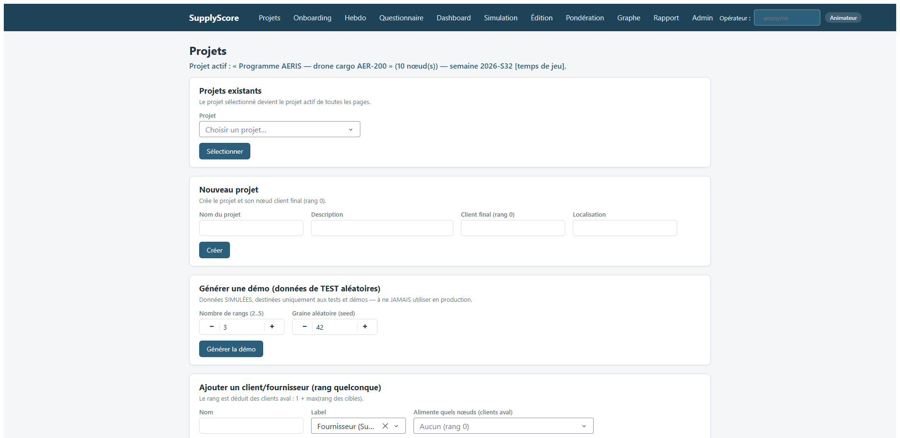

### Visual Cues
* Welcome the audience and introduce the title: **SupplyScore Urgency Adequation Framework: Aligning Subjective Perceptions with Physical Realities**.
* Highlight the core challenge: bridging the gap between human psychology and supply chain physics.
* State the presentation structure: 21 key slides, including 6 technical deep dives, 8 operational feature showcases, and a dedicated roadmap for autonomous decision-guidance agents.

### Speaker Script
Welcome, ladies and gentlemen, to this deep-dive technical seminar on the SupplyScore Urgency Adequation Framework. Over the next three hours, we will explore one of the most persistent and resource-draining challenges in modern supply chain management: the misalignment between subjective human declarations of urgency and the underlying physical realities of logistics networks. In high-pressure operational environments, the default human response to delay is often to raise the alarm, declaring every shipment or task as "critically urgent." This "crying wolf" phenomenon triggers a cascade of negative consequences, including cognitive fatigue for coordinators, saturated premium transport capacities, and misallocated expediting budgets. To address this, we have developed a unified mathematical and algorithmic platform that mathematically reconciles subjective human perceptions, elicited through structured multi-criteria decision-making, with objective physical indicators like inventory levels, lead-time variances, and transport delays. This framework doesn't simply dismiss human input; instead, it establishes an asymmetric adequation engine that quantifies cognitive bias, detects hidden risks, and filters out false urgency. By the end of this session, you will understand the full architecture, the deep mathematical foundations, and the codebase implementation details of this framework, showing how we turn subjective noise into structured, actionable operational decisions.

### Technical Notes
* **Codebase Entrypoint**: `supplyscore/services/orchestrator.py` - containing the orchestrating facade `SupplyScoreService`.
* **Mathematical Core Packages**: `supplyscore/core` (AHP, adequation), `supplyscore/mcda` (FBWM, PROMETHEE II), `supplyscore/mc` (Monte Carlo Simulation), and `supplyscore/graph` (propagation engine).
* **Assumptions**: Subjective urgency and physical urgency can be quantified on compatible scales and propagated through a supply chain Directed Acyclic Graph (DAG).
* **Literature Context**: Industrial operations research, multi-criteria decision analysis (MCDA), and behavioral operations management.

---

## Slide 2: Presenter Biography & Context

### Visual Asset
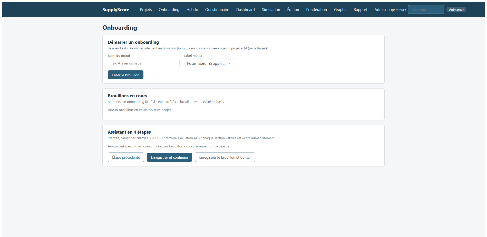

### Visual Cues
* Introduce the speaker: **John Hoarau (Industrial Engineer and Supply Chain Scientist)**.
* Highlight the interdisciplinary nature of the presenter's work: engineering, mathematics, and software design.
* Point to the onboarding workflow shown on the slide, illustrating how new nodes are integrated into the system.
* Detail the four stages of the onboarding wizard (Identity, Specifications, KPIs, Baseline AHP).

### Speaker Script
Before we dive into the mathematics and code, let me briefly introduce myself and the context of this project. My name is John Hoarau, and I work as an Industrial Engineer and Supply Chain Scientist. Throughout my career, I have focused on the intersection of operations research, stochastic simulation, and human factors in logistics. This project, SupplyScore, was born out of a real-world need observed in multiple automotive and aerospace supply chains: the fact that scheduling systems (MRPs) are mathematically optimal but operationally fragile because they ignore the cognitive states of the people running them. My goal has been to formalize these subjective heuristics using robust multi-criteria decision analysis (MCDA) and stochastic modeling. In this presentation, we will walk through the exact software architecture we designed to deploy these models at scale, moving from registry databases to real-time Dash-based user interfaces. We will look at how new node onboarding, as shown in the screenshot, serves as the gatekeeper for data quality and model calibration. New nodes are onboarded through a strict 4-step wizard that captures: first, the node identity and topological connections; second, the specifications, milestones, and costs targets; third, the initial KPI baseline values; and fourth, the baseline AHP pairwise comparisons matrix.

### Technical Notes
* **Target System Designer**: John Hoarau.
* **Code Reference**: Onboarding flow logic is managed by `supplyscore/services/onboarding.py`.
* **Onboarding Stages**:
  1. *Identité*: Nom, label, localisation, tags, et connexions (coefficients $\gamma$ et $\beta$, type nominal/backup).
  2. *Cahier des charges*: Volumes de livrables, jalons datés (début, échéance), coûts cibles, exigences qualité.
  3. *KPIs*: Saisie des indicateurs physiques initiaux (OEE, capacités, délais, coûts, CO2).
  4. *Évaluation*: Première comparaison AHP établissant le $Ud$ initial.
* **Database Schema Reference**: User details and client registry configurations are initialized in the `registry.sqlite` global database under the `nodes` and `projects` tables.
* **UI Component**: Onboarding page served by `supplyscore/web_ui/pages/onboarding.py`.
* **Validation Check**: A node cannot save section 4 or mark onboarding as `complete` if it contains any blocking validation issue (severity `"erreur"`), such as non-finite values or out-of-bounds geographic coordinates.

---

## Slide 3: The BIG Problematic: Cognitive Bias in Urgency Declaration

### Visual Asset


### Visual Cues
* Point out the different layers of the schema: the subjective layer (human perception, declarations, stress) versus the objective layer (inventories, lead times, physical capacity).
* Discuss the cycle of "crying wolf": how frequent false urgencies lead to desensitization (operational fatigue) and eventually system-wide capacity saturation.
* Highlight the target: creating a mathematical translation layer between these strata.

### Speaker Script
Let us frame the core problem we are solving. In any complex supply chain, stakeholders at different nodes act under bounded rationality. When a supplier experiences a minor disruption, their immediate reaction is to declare a high level of urgency to secure transport capacity or engineering attention. When everyone cries wolf, the premium transport network becomes saturated, costs skyrocket, and the logistics team suffers from severe operational fatigue, leading them to ignore genuinely critical alerts. This slide shows our structural model of these cognitive strata. At the top, we have the subjective perceptions of urgency ($Ud$, or declared urgency), which are prone to emotional bias, local optimization, and panic. At the bottom, we have the physical realities ($Ur$, or real urgency), which are governed by deterministic inventory run-out times, stochastic transit delays, and network constraints. The central contribution of the SupplyScore framework is the mathematical formulation of a translation and comparison layer between these strata. By quantifying the gap between what humans *say* is urgent and what the physical data *proves* is urgent, we can identify "false urgency" (unjustified panic) and "hidden risk" (silent, under-declared dangers). This allows organizations to rebuild trust in their alerting systems and optimize resource allocation. Crucially, the mathematical and operational consistency of this system depends on nine fundamental hypotheses and invariants, which are built directly into the codebase and are documented on the slide.

### Modeling Hypotheses & System Invariants
To ensure a perfectly working and mathematically consistent application, the framework relies on nine core assumptions:
1. **DAG Topology Invariant**:
   * *Hypothesis*: The supply network is modeled as a Directed Acyclic Graph (DAG) where rank 0 is the final customer and higher ranks are upstream suppliers.
   * *Implication*: Prevents infinite feedback loops during the upstream ($Ur$) and downstream ($Ud$) propagation calculations. Operationally, any cyclic topology (feedback loops) is rejected by the database integrity layer during node/arc creation, and the topological sorting algorithm in the `PropagationEngine` runs deterministically in linear $O(V + E)$ time.
2. **Weekly Discretization**:
   * *Hypothesis*: All weekly reviews, AHP assessments, and KPI snapshots follow a strict ISO weekly cycle (Monday to Sunday) linked to the project's clock.
   * *Implication*: Simplifies data comparisons. Instead of tracking data in continuous time, the system compares weekly snapshots, reducing query complexity. In the database, the primary key of `weekly_reviews` and `urgency_history` uses the `iso_week` string as a key dimension, ensuring that historical comparisons are aligned.
3. **Leaky Downstream Damping**:
   * *Hypothesis*: Declared urgency ($Ud$) decays downstream as a product formulation scaled by $\gamma \in [0, 1]$.
   * *Implication*: Dampens panic signals. If a customer declares a critical urgency ($Ud = 1.0$), a distant raw material supplier will receive a softened signal depending on the intermediate connections. In the code (`propagation.py`), this keeps propagated $Ud$ bounded within $[0, 1]$ and avoids saturation.
4. **Leaky Upstream Contamination**:
   * *Hypothesis*: Physical risk ($Ur$) propagates upstream scaled by $\beta \in [0, 1]$, representing the ripple effect of raw material delays.
   * *Implication*: Models the cascade of operational risk. If a Tier 2 supplier experiences a major disruption ($Ur_{local} = 1.0$), the threat to the final assembly line is scaled by the link dependencies $\beta$. This allows the system to identify critical nodes before they cause final lines to stop.
5. **Noisy-OR Independence**:
   * *Hypothesis*: The six KPI blocks (Time, Capacity, Performance, Risk, Cost, Carbon) are assumed to be independent sources of urgency.
   * *Implication*: Allows probabilistic OR aggregation: $Ur_{local} = 1 - \prod_m (1 - u_m)^{\omega_m}$. If any single block suffers a complete failure ($u_m = 1.0$), the local physical risk immediately becomes $1.0$, regardless of other block scores. This mimics high-consequence failure modes in manufacturing, where one bottleneck stops the entire line.
6. **Task Status Exclusions**:
   * *Hypothesis*:
     - `DONE` nodes set their effective local Ur to $0.0$ (no risk remains), but still propagate their $Ud$ downstream to preserve structural demand dependencies.
     - `ABANDONED` nodes set their effective local Ur to $1.0$ (complete failure).
   * *Implication*: When a task is complete (`DONE`), it no longer presents physical risk to the network, so it stops propagating $Ur$ upstream. However, to preserve the structural dependency in the database, it continues to propagate $Ud$ downstream (Decision #1). Abandoning a node propagates a critical risk ($Ur=1.0$) to all downstream clients.
7. **Stochastic PERT Independence**:
   * *Hypothesis*: Lead times at different nodes are stochastically independent during Monte Carlo simulations.
   * *Implication*: Simplifies Monte Carlo simulation by sampling lead times independently. While it ignores correlations between suppliers (e.g. regional storms affecting all nearby nodes), it allows fast simulation runs ($O(N \cdot n)$) which fit within memory budgets.
8. **Asymmetric Cognitive Loss**:
   * *Hypothesis*: The penalty for under-declaring risk (Hidden Risk, $\lambda_{under} = 2.25$) is strictly greater than the penalty for over-declaring (False Urgency, $\lambda_{over} = 1.0$), with a constant psychophysical curvature $\alpha = 0.88$.
   * *Implication*: Penalizes complacency. A coordinator who under-reports danger receives a low adequation score, triggering dashboard warnings. The power exponent $\alpha$ models diminishing sensitivity, meaning a large mismatch is penalized, but the marginal penalty decreases for extreme errors, aligning with Prospect Theory.
9. **Multi-tenant Data Isolation**:
   * *Hypothesis*: Local node operational histories (KPIs, assessments, logs) are completely isolated in separate database files `<client_id>.sqlite`.
   * *Implication*: Prevents database write conflicts (locking) when multiple operators submit reviews concurrently. It also enforces security boundaries, ensuring one supplier node cannot read the raw operational history of another.

### Technical Notes
* **Key Variables**: $Ud$ (subjective declared urgency), $Ur$ (objective real urgency).
* **Main Pathologies**: Fausse urgency ($F = [Ud - Ur]_+$) and Risque caché ($H = [Ur - Ud]_+$).
* **Literature**: Cognitive biases in decision-making (Simon, 1957; Kahneman & Tversky, 1979).
* **Code File for Models**: `supplyscore/domain/models.py`, which defines the `UrgencyState` class containing `ud`, `ur`, `false_urgency`, `hidden_risk`, and `adequation`.


---

## Slide 4: Project Architecture & Data Schema

### Visual Asset


### Visual Cues
* Trace the flow of data from the user input (UI/questionnaire) to the database, through the Facade, and into the graph repository.
* Explain the separation between the global registry (`registry.sqlite`) and the node-level client databases (`<client_id>.sqlite`).
* Emphasize the role of `MutationService` as the gatekeeper for all data writes, ensuring auditability and validation.

### Speaker Script
Now, let's look under the hood of the SupplyScore application. The system is designed around a single Facade service, `SupplyScoreService`, located in `supplyscore/services/orchestrator.py`. This class coordinates the mathematical core, the graph repository, and the persistence layers. To ensure strict data isolation and scalability, we implement a multi-tenant SQLite database schema. A global database, `registry.sqlite`, stores the global network registry, including node metadata, topological connections (arcs), projects, and system-wide configurations. Meanwhile, each individual node has its own database, named `<client_id>.sqlite`, which holds private local records, such as daily KPI history, AHP assessment details, and weekly review logs. All database writes are forced through `MutationService` in `supplyscore/services/mutations.py`. This service performs four critical actions in a single transaction: it diffs changes to avoid redundant writes, validates data ranges (e.g., ensuring KPIs are within physical boundaries), logs the mutation in the audit log (`audit_log`), and synchronizes the in-memory graph repository. This architecture ensures that no data can be modified without generating a verifiable audit trail, which is crucial for forensic validation.

### Technical Notes
* **Facade Class**: `SupplyScoreService` in `supplyscore/services/orchestrator.py`.
* **Global Registry Schema**: `registry.sqlite` containing tables:
  ```sql
  CREATE TABLE projects (id TEXT PRIMARY KEY, name TEXT NOT NULL);
  CREATE TABLE nodes (id TEXT PRIMARY KEY, name TEXT NOT NULL, label TEXT NOT NULL, kind TEXT NOT NULL, rank INTEGER NOT NULL, project_id TEXT REFERENCES projects(id) ON DELETE SET NULL, location TEXT, latitude REAL, longitude REAL, status TEXT NOT NULL, kpis_json TEXT NOT NULL);
  CREATE TABLE arcs (source_id TEXT NOT NULL REFERENCES nodes(id) ON DELETE CASCADE, target_id TEXT NOT NULL REFERENCES nodes(id) ON DELETE CASCADE, label TEXT NOT NULL, gamma REAL NOT NULL, beta REAL NOT NULL, delta REAL NOT NULL, kpis_json TEXT NOT NULL, PRIMARY KEY (source_id, target_id));
  ```
* **Client Node Database Schema**: `<client_id>.sqlite` containing tables:
  ```sql
  CREATE TABLE kpi_snapshots (node_id TEXT NOT NULL, timestamp REAL NOT NULL, kpis_json TEXT NOT NULL, PRIMARY KEY(node_id, timestamp));
  CREATE TABLE assessments (id INTEGER PRIMARY KEY AUTOINCREMENT, node_id TEXT NOT NULL, project_id TEXT NOT NULL, operator_id TEXT NOT NULL, comparisons_json TEXT NOT NULL, criteria_scores_json TEXT NOT NULL, weights_json TEXT NOT NULL, lambda_max REAL NOT NULL, consistency_index REAL NOT NULL, consistency_ratio REAL NOT NULL, ud REAL NOT NULL, ud_smoothed REAL NOT NULL, iso_week TEXT NOT NULL, timestamp REAL NOT NULL, replaces_id INTEGER);
  CREATE TABLE weekly_reviews (node_id TEXT NOT NULL, iso_week TEXT NOT NULL, volets_json TEXT NOT NULL DEFAULT '{}', started_at REAL, completed_at REAL, PRIMARY KEY (node_id, iso_week));
  CREATE TABLE audit_log (id INTEGER PRIMARY KEY AUTOINCREMENT, entity_type TEXT NOT NULL, entity_id TEXT NOT NULL, field TEXT NOT NULL, old_value TEXT, new_value TEXT, source TEXT NOT NULL, operator_id TEXT NOT NULL DEFAULT '', iso_week TEXT NOT NULL, timestamp REAL NOT NULL);
  ```
* **Writing Path**: `MutationService` in `supplyscore/services/mutations.py` which manages database-level writes and calls `GraphRepository` synchronization.
* **In-Memory Graph**: networkx-backed repository (`InMemoryGraphRepository` in `supplyscore/graph/memory_repo.py`).

---

## Slide 5: Deep Dive 1: Analytic Hierarchy Process (AHP) for Ud Elicitation

### Visual Asset
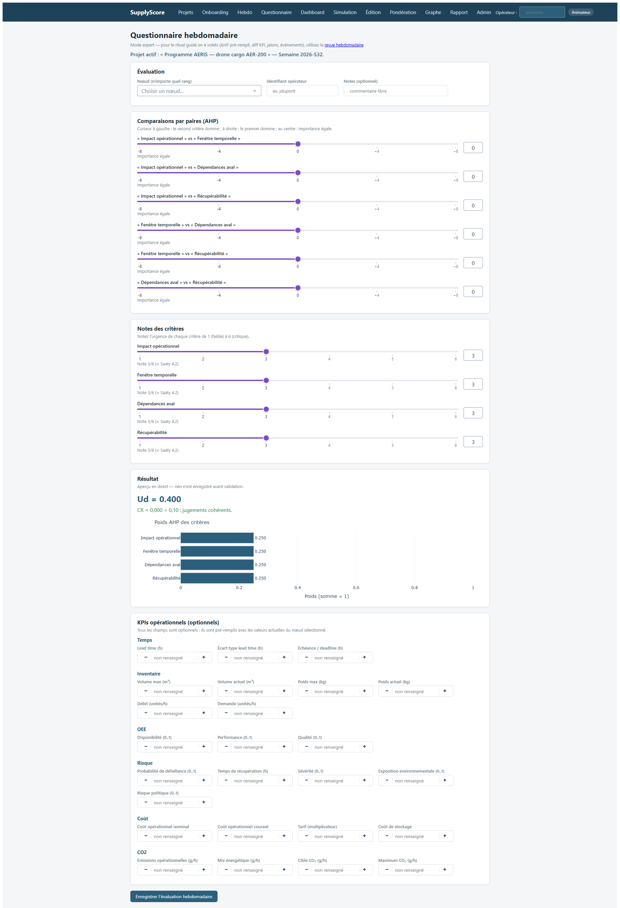

### Visual Cues
* Point to the pairwise comparison sliders in the screenshot, showing how users compare the 4 criteria.
* Show the 4 criteria: C1 (Impact opérationnel), C2 (Fenêtre temporelle), C3 (Dépendances aval), C4 (Récupérabilité).
* Walk through the mathematical steps: building the reciprocal positive matrix $A$, normalising the columns, calculating the priority vector $w$, and computing the consistency ratio $CR$.

### Speaker Script
The first deep dive concerns the elicitation of human-declared urgency, denoted as $Ud$. To capture subjective perceptions without allowing users to simply enter a raw, arbitrary number, we implement Saaty's Analytic Hierarchy Process (AHP). In our system, the weekly questionnaire compares 4 key criteria two-by-two: operational impact, temporal window, downstream dependencies, and recoverability. The user inputs their judgments via a bipolar UI slider ranging from -8 to +8, which we map to Saaty's scale $[1/9, 9]$ using the function `bipolar_to_saaty`. These judgments form a reciprocal positive matrix $A \in \mathbb{R}^{4 \times 4}$. We then approximate the principal eigenvector (the priority vector $w$) by normalising each column and calculating the mean of each row. Crucially, we compute Saaty's Consistency Ratio ($CR = CI / RI$). If $CR \ge 0.10$, the judgments are deemed inconsistent (potentially random or contradictory), and the UI warns the user. To prevent sudden spikes in perception, we apply an exponential moving average (EMA) filter: $Ud_t = \rho Ud_{t-1} + (1-\rho)Ud_{current}$ with a smoothing factor $\rho = 0.3$. This ensures that temporary stress spikes do not disrupt the downstream network.

### Technical Notes
* **Code File**: `supplyscore/core/ahp.py`
* **Key Functions**: `AHPResult` (NamedTuple), `build_matrix`, `priority_vector`, `consistency_ratio`, `bipolar_to_saaty`, `score_6_to_9`, `compute_ud`, `ud_smoothed`.
* **Database Table**: `assessments` in client database `<client_id>.sqlite`.
* **Equations**:
  * Reciprocal positive matrix: $A \in \mathbb{R}^{n \times n}$ where $A_{ij} > 0$ and $A_{ji} = 1 / A_{ij}$ with $A_{ii} = 1$.
  * Priority vector approximation:
    $$w_i = \text{mean}_j\left( \frac{A_{ij}}{\sum_k A_{kj}} \right)$$
  * Consistency Index:
    $$CI = \frac{\lambda_{\max} - n}{n - 1}$$
    where $\lambda_{\max} = \text{mean}\left( \frac{(Aw)_i}{w_i} \right)$.
  * Consistency Ratio:
    $$CR = \frac{CI}{RI(n)}$$
    where $RI(4) = 0.90$.
  * EMA Smoothing:
    $$Ud_t = \rho Ud_{t-1} + (1-\rho)Ud_{current} \quad \text{with } \rho = 0.3$$
* **Concrete Numerical Example**:
  Suppose a user fills the questionnaire, resulting in the following comparisons matrix:
  $$A = \begin{pmatrix} 1.0 & 3.0 & 2.0 & 5.0 \\ 1/3 & 1.0 & 0.5 & 2.0 \\ 0.5 & 2.0 & 1.0 & 3.0 \\ 0.2 & 0.5 & 1/3 & 1.0 \end{pmatrix}$$
  1. We normalize each column by dividing each element by its column sum:
     $$\text{Column Sums} = \begin{pmatrix} 2.0333 & 6.5000 & 3.8333 & 11.0000 \end{pmatrix}$$
     $$A_{norm} \approx \begin{pmatrix} 0.4918 & 0.4615 & 0.5217 & 0.4545 \\ 0.1639 & 0.1538 & 0.1304 & 0.1818 \\ 0.2459 & 0.3077 & 0.2609 & 0.2727 \\ 0.0984 & 0.0769 & 0.0870 & 0.0909 \end{pmatrix}$$
  2. We take the row means to get the priority vector $w$:
     $$w \approx \begin{pmatrix} 0.4824 \\ 0.1575 \\ 0.2718 \\ 0.0883 \end{pmatrix}$$
  3. We compute $\lambda_{\max}$ and consistency metrics:
     $$Aw \approx \begin{pmatrix} 1.9416 \\ 0.6312 \\ 1.0931 \\ 0.3541 \end{pmatrix} \implies \frac{(Aw)_i}{w_i} \approx \begin{pmatrix} 4.0247 \\ 4.0075 \\ 4.0217 \\ 4.0099 \end{pmatrix} \implies \lambda_{\max} \approx 4.0145$$
     $$CI = \frac{4.0145 - 4}{3} \approx 0.0048 \implies CR = \frac{0.0048}{0.90} \approx 0.0054$$
     Since $CR = 0.0054 < 0.10$, the comparisons are highly consistent.
  4. With local scores $s = \begin{pmatrix} 5.0 & 3.0 & 4.0 & 2.0 \end{pmatrix}^T$, we compute $Ud_{current}$:
     $$\text{Weighted Score} = \sum w_j s_j \approx 0.4824(5) + 0.1575(3) + 0.2718(4) + 0.0883(2) = 4.1481$$
     $$Ud_{current} = \frac{4.1481 - 1}{8} \approx 0.3935$$
  5. Applying EMA smoothing with previous $Ud_{t-1} = 0.30$:
     $$Ud_t = 0.3(0.30) + 0.7(0.3935) \approx 0.3655$$
* **Literature**: Saaty, T. L. (1977). "A scaling method for priorities in hierarchical structures." *Journal of Mathematical Psychology*.
* **Limitations**: The system uses the column mean approximation rather than the exact power iteration for the principal eigenvector. The method suffers from consistency degradation above 7 criteria (which is why our model is strictly limited to 4 criteria).

---

## Slide 6: Deep Dive 2: Triangular Fuzzy Best-Worst Method (F-BWM)

### Visual Asset
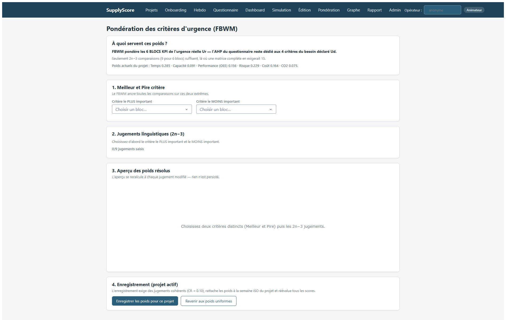

### Visual Cues
* Explain why BWM is preferred over AHP for weights: it requires only $2n-3$ comparisons instead of $n(n-1)/2$.
* Point to the Best and Worst selectors in the UI, and the linguistic scale comparisons.
* Explain how linguistic expressions are converted into Triangular Fuzzy Numbers (TFN).

### Speaker Script
Moving on to the second deep dive, let's discuss how we weight the six blocks of real urgency ($Ur$). Instead of using AHP, which requires a high number of pairwise comparisons ($n(n-1)/2$), we implement the Fuzzy Best-Worst Method (F-BWM), based on the work of Guo and Zhao. The coordinator designates the "Best" (most important) and "Worst" (least important) urgency criteria. They then perform $2n-3$ comparisons, evaluating the Best criterion against all others (Best-to-Others), and all others against the Worst (Others-to-Worst). These comparisons are expressed linguistically (e.g., "highly important") and mapped to Triangular Fuzzy Numbers (TFNs) on a 1-7 scale. We then solve a non-linear constrained optimization problem using Scipy's SLSQP algorithm to find the optimal fuzzy weights $(l_j, m_j, u_j)$ for each criterion, minimizing the consistency indicator $\xi$. These fuzzy weights are then defuzzified using the Graded Mean Integration Representation (GMIR) formula: $R(w_j) = (l_j + 4m_j + u_j)/6$, and normalized to sum to 1. If the optimization fails to converge, the system gracefully falls back to uniform weights, preventing system crashes.

### Technical Notes
* **Code File**: `supplyscore/mcda/fbwm.py`
* **Key Functions**: `resoudre_fbwm`, `ResultatFBWM`, `_gmir`, `_resoudre`, `_point_initial`.
* **Equations**:
  * Optimization problem:
    $$\min \xi^*$$
    $$\text{s.t. } \left| \frac{(l_B, m_B, u_B)}{(l_j, m_j, u_j)} - \tilde{a}_{Bj} \right| \le (\xi, \xi, \xi) \quad \forall j \neq B$$
    $$\left| \frac{(l_j, m_j, u_j)}{(l_W, m_W, u_W)} - \tilde{a}_{jW} \right| \le (\xi, \xi, \xi) \quad \forall j \neq W$$
    $$\sum_j R(w_j) = 1, \quad 0 < \text{eps} \le l_j \le m_j \le u_j \quad \forall j$$
  * Defuzzification (GMIR):
    $$w_j = \frac{l_j + 4m_j + u_j}{6}$$
    (renormalized to $\sum w_j = 1$).
  * Consistency Ratio:
    $$CR_{BWM} = \frac{\xi^*}{CI}$$
    where $CI$ is retrieved from `TABLE_CI` based on the strongest linguistic judgment.
* **Linguistic Judgements to TFN Mapping**:
  * `egalement_important`: $(1, 1, 1)$, $CI = 3.00$
  * `faiblement_plus_important`: $(2/3, 1, 3/2)$, $CI = 3.80$
  * `assez_plus_important`: $(3/2, 2, 5/2)$, $CI = 5.29$
  * `tres_plus_important`: $(5/2, 3, 7/2)$, $CI = 6.69$
  * `absolument_plus_important`: $(7/2, 4, 9/2)$, $CI = 8.04$
* **Concrete Numerical Example**:
  Suppose a coordinator evaluates 3 criteria: C1 (Time), C2 (Capacity), C3 (Risk).
  * Best = C1, Worst = C3.
  * Best-to-Others comparisons:
    * C1 vs C2: `assez_plus_important` $\to \tilde{a}_{12} = (1.5, 2, 2.5)$
    * C1 vs C3: `tres_plus_important` $\to \tilde{a}_{13} = (2.5, 3, 3.5)$
  * Others-to-Worst comparisons:
    * C1 vs C3: `tres_plus_important` $\to \tilde{a}_{13} = (2.5, 3, 3.5)$
    * C2 vs C3: `assez_plus_important` $\to \tilde{a}_{23} = (1.5, 2, 2.5)$
  Solving this constrained optimization using Scipy SLSQP yields the optimal fuzzy weights:
  * Fuzzy weight C1: $(0.4742, 0.5408, 0.5680)$
  * Fuzzy weight C2: $(0.2271, 0.3019, 0.3565)$
  * Fuzzy weight C3: $(0.1531, 0.1685, 0.1759)$
  * Optimal $\xi^* \approx 0.2087$
  * Defuzzified GMIR weights $R(w_j) = (l_j + 4m_j + u_j)/6$:
    * $R(w_1) = 0.5342$
    * $R(w_2) = 0.2986$
    * $R(w_3) = 0.1672$
  * Consistency Ratio:
    $$CR = \frac{0.2087}{6.69} \approx 0.0312$$
    Since $CR = 0.0312 < 0.10$, the weightings are consistent.
* **Literature**: Rezaei, J. (2015). "Best-worst multi-criteria decision-making method." *Omega*. Guo, S., & Zhao, H. (2017). "Fuzzy best-worst multi-criteria decision-making method and its applications." *Knowledge-Based Systems*.
* **Limitations**: Sensitivity of optimization outcomes to the initial starting points and the exact shape of the fuzzy membership functions.

---

## Slide 7: Deep Dive 3: PROMETHEE II for Network Outranking

### Visual Asset
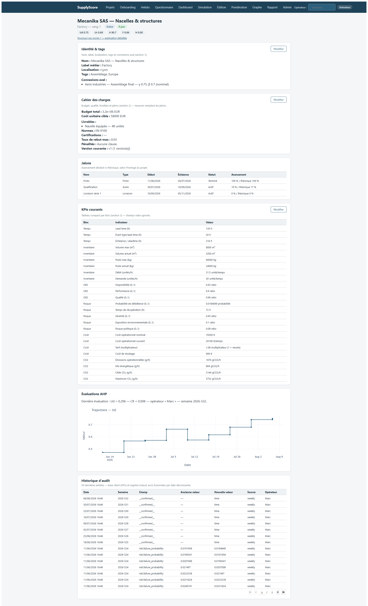

### Visual Cues
* Explain outranking: it doesn't just average scores, it compares alternatives pair-by-pair.
* Detail the preference functions, highlighting our default: Type V Linear with Indifference zone ($q=0.05, p=0.30$).
* Trace the calculation of positive flow $\phi^+$, negative flow $\phi^-$, and net flow $\phi$.

### Speaker Script
Our third deep dive focus is PROMETHEE II, a multi-criteria outranking method used to rank the active supply chain nodes to determine which ones require immediate attention. Unlike simple additive weighting, which allows a very good score on one criterion to completely compensate for a catastrophic score on another, PROMETHEE II is based on pairwise comparisons. For every pair of nodes $(a, b)$ and each of the six urgency criteria, we compute the difference $d = g(a) - g(b)$. This difference is transformed into a preference intensity $P(d) \in [0, 1]$ using a preference function. In our codebase, we support multiple types of preference functions, but we default to the Type V Linear function with an indifference threshold $q=0.05$ and a preference threshold $p=0.30$. We then calculate the aggregated preference index $\pi(a, b)$, representing the degree to which node $a$ is preferred to $b$. From this, we compute the positive outranking flow $\phi^+(a)$ (the strength of node $a$ over all others) and the negative outranking flow $\phi^-(a)$ (the weakness of $a$ relative to all others). The net outranking flow, $\phi(a) = \phi^+(a) - \phi^-(a)$, yields a complete pre-order ranking of all nodes. Finally, we normalize this net flow to scale the "business value" into a range of $[0, 1]$ via $BV_i = (\phi_i + 1)/2$, giving coordinators a clear, normalized indicator of relative operational risk.

### Technical Notes
* **Code File**: `supplyscore/mcda/promethee.py`
* **Key Classes/Functions**: `PrometheeII`, `Critere`, `ResultatPromethee`, preference functions: `Usuelle`, `UShape`, `VShape`, `Palier`, `LineaireIndifference`, `Gaussienne`.
* **Equations**:
  * Aggregate preference index:
    $$\pi(a, b) = \sum_{j} w_j P_j(g_j(a) - g_j(b))$$
  * Positive flow:
    $$\phi^+(a) = \frac{1}{n-1} \sum_{b \neq a} \pi(a, b)$$
  * Negative flow:
    $$\phi^-(a) = \frac{1}{n-1} \sum_{b \neq a} \pi(b, a)$$
  * Net flow:
    $$\phi(a) = \phi^+(a) - \phi^-(a)$$
  * Normalized Business Value:
    $$BV_i = \frac{\phi_i + 1}{2}$$
* **Concrete Numerical Example**:
  Suppose we rank 3 supplier nodes (Node A, Node B, Node C) on 2 criteria: $c_1$ (weight 0.6) and $c_2$ (weight 0.4), using Type V preference functions ($q=0.05, p=0.30$).
  * Alternate values:
    * Node A: $c_1 = 0.8$, $c_2 = 0.3$
    * Node B: $c_1 = 0.5$, $c_2 = 0.6$
    * Node C: $c_1 = 0.2$, $c_2 = 0.9$
  * Pairwise comparisons:
    * **Node A vs Node B**:
      * $d_{c1}(A, B) = 0.8 - 0.5 = 0.30 \ge p \implies P_{c1}(d) = 1.0$
      * $d_{c2}(A, B) = 0.3 - 0.6 = -0.30 \le 0 \implies P_{c2}(d) = 0.0$
      * $\pi(A, B) = 0.6(1.0) + 0.4(0.0) = 0.60$
      * $d_{c1}(B, A) = -0.30 \le 0 \implies P_{c1}(d) = 0.0$
      * $d_{c2}(B, A) = 0.6 - 0.3 = 0.30 \ge p \implies P_{c2}(d) = 1.0$
      * $\pi(B, A) = 0.6(0.0) + 0.4(1.0) = 0.40$
    * **Node B vs Node C**:
      * $d_{c1}(B, C) = 0.5 - 0.2 = 0.30 \implies P_{c1}(d) = 1.0$; $d_{c2}(B, C) = -0.30 \implies P_{c2}(d) = 0.0 \implies \pi(B, C) = 0.60$
      * $d_{c1}(C, B) = -0.30 \implies P_{c1}(d) = 0.0$; $d_{c2}(C, B) = 0.30 \implies P_{c2}(d) = 1.0 \implies \pi(C, B) = 0.40$
    * **Node A vs Node C**:
      * $d_{c1}(A, C) = 0.60 \ge p \implies P_{c1}(d) = 1.0$; $d_{c2}(A, C) = -0.60 \implies P_{c2}(d) = 0.0 \implies \pi(A, C) = 0.60$
      * $d_{c1}(C, A) = -0.60 \implies P_{c1}(d) = 0.0$; $d_{c2}(C, A) = 0.60 \ge p \implies P_{c2}(d) = 1.0 \implies \pi(C, A) = 0.40$
  * Aggregated outranking flows:
    * **Node A**:
      * $\phi^+(A) = \frac{1}{2}(\pi(A, B) + \pi(A, C)) = \frac{1}{2}(0.60 + 0.60) = 0.60$
      * $\phi^-(A) = \frac{1}{2}(\pi(B, A) + \pi(C, A)) = \frac{1}{2}(0.40 + 0.40) = 0.40$
      * $\phi(A) = 0.60 - 0.40 = +0.20 \implies BV_A = (0.20 + 1)/2 = 0.60$
    * **Node B**:
      * $\phi^+(B) = \frac{1}{2}(0.40 + 0.60) = 0.50$; $\phi^-(B) = \frac{1}{2}(0.60 + 0.40) = 0.50 \implies \phi(B) = 0.00 \implies BV_B = 0.50$
    * **Node C**:
      * $\phi^+(C) = \frac{1}{2}(0.40 + 0.40) = 0.40$; $\phi^-(C) = \frac{1}{2}(0.60 + 0.60) = 0.60 \implies \phi(C) = -0.20 \implies BV_C = 0.40$
  * Final ranking: Node A (1st), Node B (2nd), Node C (3rd).
* **Literature**: Brans, J.-P., & Vincke, Ph. (1985). "A preference ranking organisation method: The PROMETHEE method for MCDA." *Management Science*.
* **Limitations**: Scale sensitivity of threshold parameters ($p$ and $q$ must be carefully calibrated). PROMETHEE II is susceptible to rank reversal (adding or removing a node can change the relative ranking of other nodes).

---

## Slide 8: Deep Dive 4: Stochastic Monte Carlo Lead Time (PERT)

### Visual Asset
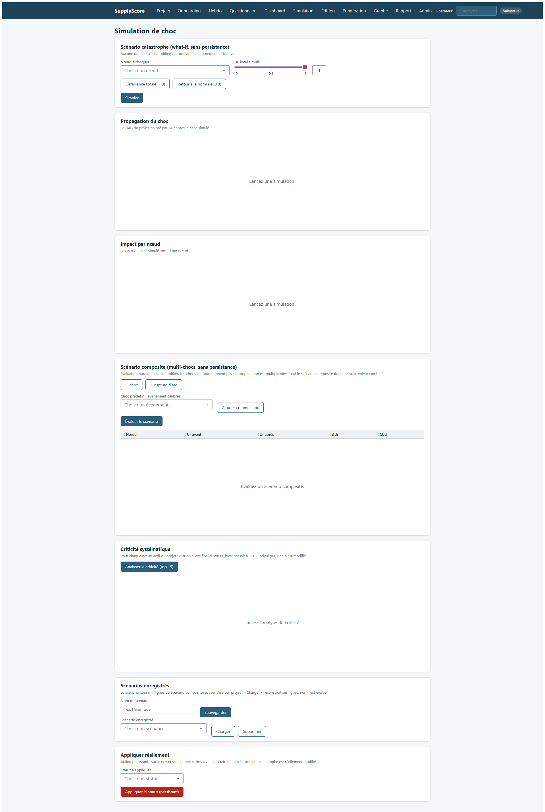

### Visual Cues
* Point to the lead-time distribution charts in the screenshot.
* Explain the Monte Carlo approach: we simulate completion times by drawing random variables for each node in topological order.
* Detail the probability families: Normal (clipped to 0), Lognormal (parameterized by moments), and Triangular.
* Highlight the memory budget guardrail: $N \times n \le 5\cdot 10^7$ with default $N = 10,000$.

### Speaker Script
Now we enter the domain of stochastic modeling with Deep Dive 4: our Monte Carlo simulator for lead times, which provides the objective probability of delay, $u_{time}$. Standard PERT uses simple approximations that assume the maximum of multiple distributions is analytically tractible, but in reality, the maximum of lognormal distributions is not lognormal. Therefore, we run a full stochastic simulation. For each node, the lead time $L_i$ is modeled as a random variable. We support lognormal distributions (parameterized by mean $m$ and standard deviation $s$), normal distributions (clipped to 0 via `np.maximum(·, 0)` to prevent physically impossible negative lead times), and triangular distributions. The simulation runs in topological order along the supply chain DAG: the start time of node $i$ is the maximum of the completion times of its predecessors ($S_i = \max_{j \in Pred(i)} C_j$), and its completion time is $C_i = S_i + L_i$. We run $N = 10,000$ iterations. The objective delay probability is estimated as the proportion of runs where completion exceeds the deadline ($u_{time} = P(C_i > d_i)$). To prevent out-of-memory errors on large graphs, we implement a strict budget constraint: the product of the number of simulations $N$ and the number of nodes $n$ must not exceed $5 \times 10^7$.

### Technical Notes
* **Code File**: `supplyscore/mc/lead_time.py`
* **Key Classes/Functions**: `SimulateurLeadTime`, `resoudre_loi`, `tirer_lead_times`, `ResultatMC`.
* **Equations**:
  * Lognormal moments translation:
    $$\sigma^2_{ln} = \ln\left(1 + \frac{s^2}{m^2}\right)$$
    $$\mu_{ln} = \ln(m) - \frac{\sigma^2_{ln}}{2}$$
  * Recurrence relation:
     $$S_i = \max_{j \in Pred(i)} C_j, \quad C_i = S_i + L_i$$
     (where roots start at current time $t$).
  * Estimator:
    $$u_{time} = P(C_i > d_i) \approx \frac{1}{N} \sum_{k=1}^N \mathbb{I}(C_i^{(k)} > d_i)$$
  * Confidence interval (95%):
    $$\hat{p} \pm 1.96 \sqrt{\frac{\hat{p}(1-\hat{p})}{N}}$$
* **Concrete Numerical Example**:
  Suppose a serial network of 2 nodes: Node 1 (supplier) -> Node 2 (client).
  * Project start time $t = 0$. Deadline at Node 2 is $d_2 = 12$h.
  * Node 1 lead time $L_1 \sim \text{Lognormal}$ with mean $m_1 = 5$h, std $s_1 = 1$h.
    $$\sigma^2_{ln} = \ln(1 + 1/25) = \ln(1.04) \approx 0.0392 \implies \sigma_{ln} \approx 0.1980$$
    $$\mu_{ln} = \ln(5) - 0.0392/2 \approx 1.6094 - 0.0196 = 1.5898$$
  * Node 2 lead time $L_2 \sim \text{Normal}$ with mean $m_2 = 4$h, std $s_2 = 2$h (clipped to 0).
  * Run 1 Simulation Step ($k = 1$):
    * Draw $Z_1 \sim N(0,1)$ such that $Z_1 = 0.12 \implies L_1^{(1)} = \exp(1.5898 + 0.1980(0.12)) = \exp(1.6136) \approx 5.02$h
    * Draw $Z_2 \sim N(0,1)$ such that $Z_2 = -1.15 \implies L_2^{(1)} = \max(4 + 2(-1.15), 0) = \max(1.7, 0) = 1.70$h
    * Path propagation:
      * $C_1^{(1)} = 0 + L_1^{(1)} = 5.02$h
      * $S_2^{(1)} = C_1^{(1)} = 5.02$h
      * $C_2^{(1)} = S_2^{(1)} + L_2^{(1)} = 5.02 + 1.70 = 6.72$h
    * Since $C_2^{(1)} \le d_2$ ($6.72 \le 12$), this simulation run registers no delay. Repeating this $10,000$ times allows us to count total delay runs to estimate $u_{time}$.
* **Literature**: Standard Stochastic PERT literature; Sornette, D., & Johansen, A. (2001). "Signatures of panic on financial markets." *Quantitative Finance* (used for general modeling of fat-tailed distributions and threshold crossings).
* **Limitations**: High memory usage for huge graphs and large $N$. Execution time scales linearly with $N$ and $n$. The simulation ignores parallel scheduling constraints within a single supplier node (it assumes a pure serial-parallel DAG).

---

## Slide 9: Deep Dive 5: Propagation Engine on DAG

### Visual Asset
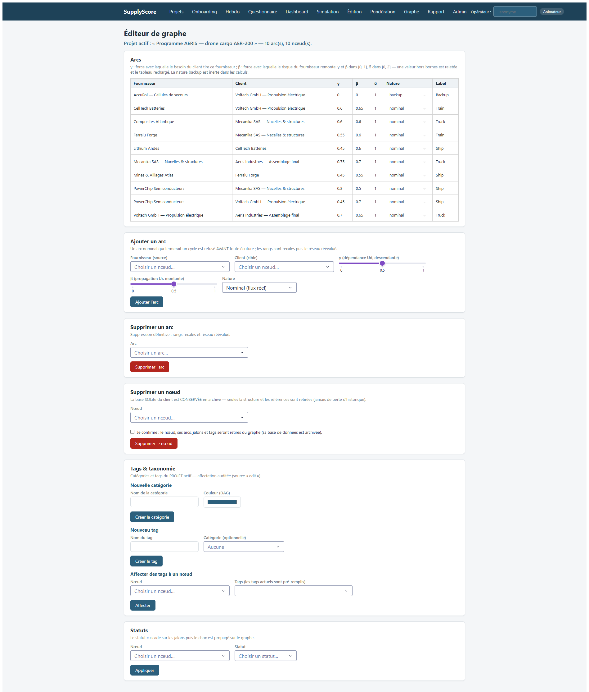

### Visual Cues
* Walk through the DAG on the slide, showing downstream flow (top-to-bottom) and upstream flow (bottom-to-top).
* Trace the math of descending Ud propagation: the declared urgency of clients propagates to their suppliers, scaled by the link parameter $\gamma_{ik}$.
* Trace the math of ascending Ur propagation: the physical risk of suppliers propagates to their clients, scaled by the link parameter $\beta_{ji}$.
* Point to the status-based rules: how `DONE` and `ABANDONED` nodes affect propagation.

### Speaker Script
In Deep Dive 5, we examine how urgency propagates through the supply chain network. The network is modeled as a Directed Acyclic Graph (DAG). Subjective declared urgency ($Ud$) propagates *downstream*—from the final customer towards the raw material suppliers—because a customer's urgent demand increases the urgency of their suppliers' tasks. Conversely, objective real urgency ($Ur$, representing physical risk and delays) propagates *upstream* (ascending)—from the suppliers to the clients—because a delay at a supplier directly threatens the client's schedule. The propagation formulas use a leaky product formulation, ensuring that urgency is bounded on $[0, 1]$ and increases monotonically as more neighbors become urgent. Crucially, we apply lifecycle status rules before propagating: a node marked `DONE` has its local real urgency $Ur$ set to 0.0 (an accomplished task no longer poses a risk), while an `ABANDONED` node has its local $Ur$ set to 1.0 (representing a complete breakdown). However, in accordance with modeling Decision #1, a `DONE` node still propagates its declared urgency $Ud$ downstream to preserve the physical dependencies in the database. Furthermore, backup arcs (`ArcKind.BACKUP`) are treated as purely documentary and do not propagate any urgency, preventing redundant feedback loops.

### Technical Notes
* **Code File**: `supplyscore/graph/propagation.py`
* **Key Classes/Functions**: `PropagationEngine`, `effective_ur_local` and `effective_ud_local` (in `supplyscore/core/status_rules.py`).
* **Equations**:
  * Descending $Ud$ propagation:
    $$Ud_i = \text{clip}\left( 1 - (1 - Ud\_loc\_i^{eff}) \prod_{k \in \text{Succ}(i)} (1 - \gamma_{ik} Ud_k) \right)$$
    where $Ud\_loc\_i^{eff} = \text{effective\_ud\_local}(\text{status}_i, ud\_local\_i)$ and $\gamma_{ik} \in [0, 1]$ is the downstream attenuation factor.
  * Ascending $Ur$ propagation:
    $$Ur_i = \text{clip}\left( 1 - (1 - Ur\_loc\_i^{eff}) \prod_{j \in \text{Pred}(i)} (1 - \beta_{ji} Ur_j) \right)$$
    where $Ur\_loc\_i^{eff} = \text{effective\_ur\_local}(\text{status}_i, ur\_local\_i)$ and $\beta_{ji} \in [0, 1]$ is the upstream amplification factor.
* **Concrete Numerical Example**:
  Consider a 3-node serial graph: Node 3 (Raw Materials) $\xrightarrow{\beta_{32}, \gamma_{23}}$ Node 2 (Sub-assembly) $\xrightarrow{\beta_{21}, \gamma_{12}}$ Node 1 (Final Assembly).
  * Network Parameters: $\gamma_{12} = 0.9$, $\gamma_{23} = 0.8$, $\beta_{32} = 0.9$, $\beta_{21} = 0.7$.
  * Node States:
    * Node 1: `status` = ACTIVE, $Ud\_loc_1 = 0.8$, $Ur\_loc_1 = 0.0$
    * Node 2: `status` = ACTIVE, $Ud\_loc_2 = 0.3$, $Ur\_loc_2 = 0.4$
    * Node 3: `status` = DONE, $Ud\_loc_3 = 0.5$, $Ur\_loc_3 = 0.6$
  * **Step 1: Descending $Ud$ propagation** (Topological order: 1, 2, 3):
    * Node 1 (Assembly, rank 0): no successors.
      $$Ud_1 = Ud\_loc\_1^{eff} = 0.80$$
    * Node 2 (Sub-assembly, rank 1): successor is Node 1.
      $$Ud_2 = 1 - (1 - Ud\_loc\_2^{eff})(1 - \gamma_{12} Ud_1) = 1 - (1 - 0.3)(1 - 0.9(0.8)) = 1 - 0.7(0.28) = 0.8040$$
    * Node 3 (Raw Materials, rank 2): successor is Node 2.
      * Crucial modeling check: Node 3 is `DONE`. Under Decision #1, its $Ud\_loc\_3^{eff} = Ud\_loc_3 = 0.5$.
      $$Ud_3 = 1 - (1 - 0.5)(1 - \gamma_{23} Ud_2) = 1 - 0.5(1 - 0.8(0.8040)) = 1 - 0.5(0.3568) = 0.8216$$
  * **Step 2: Ascending $Ur$ propagation** (Topological order: 3, 2, 1):
    * Node 3: no predecessors.
      * Status rule check: Node 3 is `DONE` $\implies Ur\_loc\_3^{eff} = 0.0$.
      $$Ur_3 = 0.0$$
    * Node 2: predecessor is Node 3.
      $$Ur_2 = 1 - (1 - Ur\_loc\_2^{eff})(1 - \beta_{32} Ur_3) = 1 - (1 - 0.4)(1 - 0.9(0.0)) = 1 - 0.6(1.0) = 0.40$$
    * Node 1: predecessor is Node 2.
      $$Ur_1 = 1 - (1 - Ur\_loc\_1^{eff})(1 - \beta_{21} Ur_2) = 1 - (1 - 0.0)(1 - 0.7(0.40)) = 1 - 1.0(0.72) = 0.28$$
* **Literature**: Ivanov, D., et al. (2025). "The Ripple Effect in Supply Chains." *International Journal of Production Research*.
* **Limitations**: Backup arcs are inert; the network must be a strict DAG (loop-free constraint, cycles are not allowed and will raise topological sorting errors).

---

## Slide 10: Deep Dive 6: Asymmetric Adequation Engine (Prospect Theory)

### Visual Asset
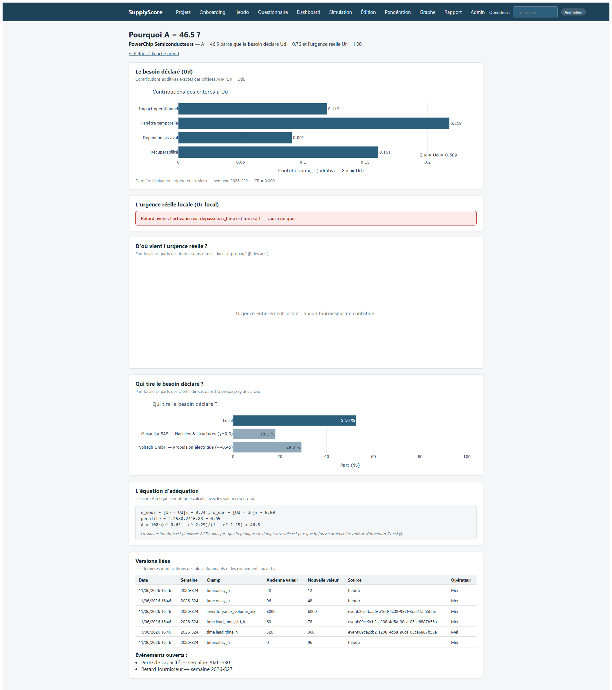

### Visual Cues
* Point to the asymmetric penalty curves on the slide.
* Explain the parameters: $\lambda_{under} = 2.25$ (the penalty for under-declaring risk, i.e., hidden risk) and $\lambda_{over} = 1.0$ (the penalty for over-declaring risk, i.e., false urgency).
* Walk through the Prospect Theory exponent $\alpha = 0.88$, showing how it models diminishing sensitivity to large errors.
* Show how the penalty is scaled into a score $A \in [0, 100]$.

### Speaker Script
Our sixth deep dive brings us to the core adequation engine, which compares subjective declared urgency ($Ud$) with objective physical reality ($Ur$). To model this, we draw on Kahneman and Tversky's Prospect Theory. We define two anomalies: False Urgency ($F = [Ud - Ur]_+$), representing over-declaration or panic, and Hidden Risk ($H = [Ur - Ud]_+$), representing under-declaration or silent danger. Our governance rule states that under-declaring a risk is far worse than panicking: a team that panics wastes premium transport resources, but a team that under-declares risk misses the window to prevent a line stoppage. Therefore, we apply asymmetric loss weights: $\lambda_{under} = 2.25$ and $\lambda_{over} = 1.0$. The penalty is calculated as: $\text{penalty} = \lambda_{under} H^\alpha + \lambda_{over} F^\alpha$ with $\alpha = 0.88$, reflecting the psychophysical curvature of human perception. This penalty is then mapped to a normalized adequation score $A \in [0, 100]$ using an exponential scaling function: $A = 100 \cdot (\exp(-\text{penalty}) - \exp(-\max\_penalty)) / (1 - \exp(-\max\_penalty))$. A score of 100 indicates perfect alignment between perception and reality, while 0 indicates complete misalignment (e.g., a critical task with a declared urgency of zero).

### Technical Notes
* **Code File**: `supplyscore/core/adequation.py`
* **Key Classes/Functions**: `AdequationEngine`, `adequation_asym`, `false_urgency`, `hidden_risk`.
* **Equations**:
  * Anomaly metrics:
    $$F = \max(Ud - Ur, 0.0), \quad H = \max(Ur - Ud, 0.0)$$
  * Prospect Theory penalty function:
    $$\text{penalty} = \lambda_{under} H^\alpha + \lambda_{over} F^\alpha$$
  * Exponential scaling function:
    $$A = 100 \cdot \frac{\exp(-\text{penalty}) - \exp(-\max\_penalty)}{1.0 - \exp(-\max\_penalty)}$$
    where $\max\_penalty = \max(\lambda_{under}, \lambda_{over}) = 2.25$.
  * Default parameters: $\lambda_{under} = 2.25$, $\lambda_{over} = 1.0$, $\alpha = 0.88$.
* **Concrete Numerical Example**:
  Let's contrast two opposite pathologies of equal absolute divergence ($0.5$):
  * **Case A: False Urgency (Sur-déclaration / Panic)**: $Ud = 0.8$, $Ur = 0.3$.
    * $F = \max(0.8 - 0.3, 0) = 0.5$; $H = \max(0.3 - 0.8, 0) = 0.0$
    * $\text{penalty} = 2.25(0.0)^{0.88} + 1.0(0.5)^{0.88} \approx 0.5434$
    * $\text{value} = \exp(-0.5434) \approx 0.5808$; $\text{floor} = \exp(-2.25) \approx 0.1054$
    * $A = 100 \cdot \frac{0.5808 - 0.1054}{1 - 0.1054} \approx 53.14\%$
  * **Case B: Hidden Risk (Sous-déclaration / Silent Danger)**: $Ud = 0.3$, $Ur = 0.8$.
    * $F = 0.0$; $H = 0.5$
    * $\text{penalty} = 2.25(0.5)^{0.88} + 1.0(0.0)^{0.88} \approx 2.25(0.5434) \approx 1.2226$
    * $\text{value} = \exp(-1.2226) \approx 0.2945$
    * $A = 100 \cdot \frac{0.2945 - 0.1054}{0.8946} \approx 21.13\%$
  * *Resulting Comparison*: Even though the error distance is identical ($|Ud - Ur| = 0.5$), the adequation score for the under-declared risk ($21.13\%$) is significantly lower than for the over-declared panic ($53.14\%$), validating the asymmetric design.
* **Literature**: Kahneman, D., & Tversky, A. (1979). "Prospect Theory: An Analysis of Decision under Risk." *Econometrica*.
* **Limitations**: The parameters ($\lambda_{under}$, $\lambda_{over}$, $\alpha$) are static and assume that expert calibration is constant across all tiers of the supply chain.

---

## Slide 11: The Weekly Review Cycle (Volets 1 to 4)

### Visual Asset
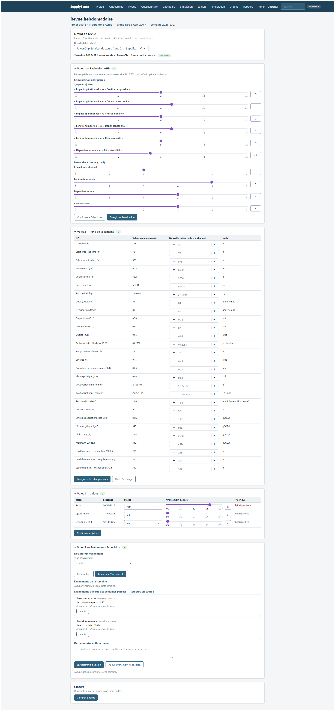

### Visual Cues
* Show how a player navigates the 4 sections of the `/hebdo` page.
* Point to the operator signature in the top right which identifies who is currently submitting the reviews.
* Emphasize the "Rien n'a changé" button which accelerates the weekly data entries.

### Speaker Script
Let's zoom in on the core user experience for node operators: the Weekly Review Cycle, served by the `/hebdo` page. In serious game mode, the coordinator advances time week-by-week. At each new turn, every node is marked "en retard" (delayed), indicating that the operator must submit their weekly review. The review process is structured into 4 sequential tabs or "volets" to ensure completeness. First, the operator fills out the AHP questionnaire, comparing the 4 declared urgency criteria. To save time, we pre-fill the sliders with the previous week's values and offer a "Confirmer à l'identique" button, which registers the review in a single click if no changes occurred. Second, they enter the actual weekly KPIs. The interface shows a table of differences (S-1 value vs new value), highlighting changes. Third, they update the progress of their active milestones, comparing the declared physical progress against the theoretical planning. Fourth, they declare any supply chain events that occurred during the week. Crucially, all writes are signed by the operator's identifier and grouped into a single atomic SQLite transaction, ensuring that no partial or anonymous reviews can corrupt the databases.

### Technical Notes
* **UI Module**: `supplyscore/web_ui/pages/hebdo.py` (and the `weekly_reviews` card).
* **Weekly Review Service**: `supplyscore/services/weekly.py` managing the operator reviews progression.
* **Database Target**: `weekly_reviews` table in `<client_id>.sqlite` tracking started and completed timestamps.
* **Equations**:
  * Avancement théorique (theoretical progress):
    $$p_{th} = \text{clip}\left(\frac{t - \text{start\_ts}}{\text{deadline\_ts} - \text{start\_ts}}, 0.0, 1.0\right)$$
    where $t$ is the current clock time.
* **Concrete Operational Walkthrough**:
  Suppose Operator "John" completes the weekly review in week `2026-S25`:
  1. *Volet 1 (AHP)*: Sliders are pre-filled at previous $Ud = 0.3655$. Click "Confirmer à l'identique".
  2. *Volet 2 (KPIs)*: Enter stock capacity depletion. Volume drops from $20.0\,\text{m}^3$ to $18.0\,\text{m}^3$.
  3. *Volet 3 (Milestones)*: Milestone `M1` has start time $t=100$, deadline $t=200$. Current game clock is $t=150 \implies p_{th} = (150-100)/(200-100) = 0.50$. The operator enters progress $= 0.40$ (under-performing, indicating a delay penalty).
  4. *Volet 4 (Events)*: Declare machine breakdown event. Submit.
  5. The `weekly.py` service commits this record atomically to the DB, setting `completed_at` to the current epoch time, changing the dashboard status badge from "En retard" to "À jour".

---

## Slide 12: The Calibrated Event Engine (14 Event Types)

### Visual Asset
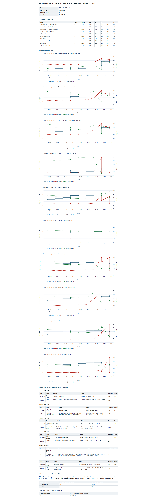

### Visual Cues
* Point to the list of declared events on the page, showing active vs past events.
* Highlight the preview button, illustrating how operators can test the impact of an event before confirming it.
* Describe the 3 math operators: Beta-Bernoulli, EMA, and Direct.

### Speaker Script
One of the most powerful features of the SupplyScore software is the Calibrated Event Engine. Planners do not manually calculate how a machine breakdown or a strike affects KPIs; instead, they declare events from a taxonomy of 14 calibrated supply chain events. Each event type has a specific mathematical footprint. We use three calibration operators: Beta-Bernoulli bayesian updates to revise failure probabilities, Exponential Moving Averages (EMA) to smooth continuous variables like OEE or lead times, and Direct updates for signed facts (like a new tariff). For example, a `panne_machine` (machine breakdown) triggers a Bayesian update on the failure probability ($p \to (p \cdot n_0 + k)/(n_0 + n)$) and reduces availability via an EMA update. To prevent double-counting, the system warns the user if they try to enter KPIs that conflict with active events. In the UI, the operator can click "Prévisualiser" (Preview) to calculate and display the transient impacts before clicking "Confirmer" to persist the event. Reverting an event is fully supported and recalculates the baseline KPIs automatically.

### Technical Notes
* **Code File**: `supplyscore/domain/events.py` (pure mathematical engine) and `supplyscore/services/events.py` (`EventEngine` service).
* **14 Event Types**: `panne_machine`, `retard_fournisseur`, `greve`, `hausse_tarif`, `rupture_matiere`, `accident`, `non_conformite_qualite`, `perturbation_transport`, `instabilite_politique`, `cyber_incident`, `hausse_energie`, `alerte_financiere_fournisseur`, `perte_capacite`, `pic_demande`.
* **Equations**:
  * Bayesian revision (Beta-Bernoulli):
    $$p_{posterior} = \text{clip}\left( \frac{p \cdot n_0 + k}{n_0 + n}, 10^{-4}, 0.99 \right)$$
    where $n_0 = 26.0$ is the prior weight (representing ~6 months of weekly observations) and $(k, n)$ represents the equivalent failures/trials of the event gravity.
  * EMA continuous lissage:
    $$x_{new} = (1 - \lambda) x_{old} + \lambda x_{obs}$$
    where $\lambda \in [0.3, 0.5]$ is the reactivity weight.
  * Cliquet (max) severity update:
    $$s_{new} = \max(s_{old}, s_{event})$$
* **Concrete Numerical Example (Strike Event)**:
  Suppose Node 1 declares a `greve` (strike) with duration $d = 24.0$ hours and fractional workforce on strike $p_f = 0.50$:
  1. Equivalent total lost hours:
     $$H_{lost} = d \cdot p_f = 24.0 \cdot 0.50 = 12.0\,\text{hours}$$
  2. Availability fraction lost in a 168-hour week:
     $$f_{lost} = \frac{12.0}{168.0} \approx 0.071429$$
  3. Observed availability observation:
     $$A_{obs} = 1.0 - 0.071429 \approx 0.928571$$
  4. Updating OEE availability using EMA update (reactivity $\lambda = 0.50$, baseline $A_{old} = 0.95$):
     $$A_{new} = (1 - 0.5) A_{old} + 0.5 \cdot A_{obs} = 0.5(0.95) + 0.5(0.928571) = 0.475 + 0.464286 = 0.939286$$
  5. Updating OEE quality and risk severity:
     * Risk severity is updated in cliquet mode:
       $$S_{new} = \max(S_{old}, p_f) = \max(0.3, 0.5) = 0.50$$

---

## Slide 13: Simulation Scenarios & What-if Shocks

### Visual Asset
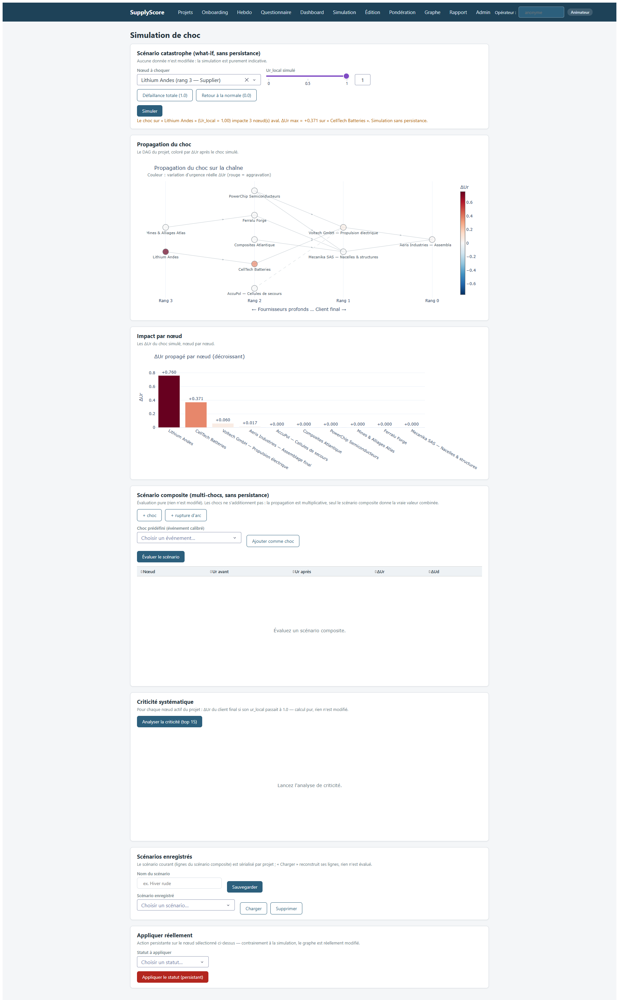

### Visual Cues
* Show the what-if simulation interface where coordinators inject shocks to stress-test the supply chain.
* Highlight the scenario dropdown where planners save named states.
* Point to the graph visualizer, showing the delta Ur values propagated upstream.

### Speaker Script
To help planners anticipate crises, SupplyScore implements named simulation scenarios and what-if shock simulations. A scenario is a named snapshot of simulation parameters (including all node states and arc coefficients) saved in the `scenarios` table of the registry database. When a coordinator wants to stress-test the chain, they can load a scenario, select a node (e.g., a critical Tier 2 supplier), and simulate a shock (e.g., setting their local Ur to 1.0). The `simulate_shock` service immediately runs the ascending propagation engine in memory, calculating the delta $\Delta Ur_i$ for every node in the graph, representing the propagated risk. Crucially, this operation is fully sandboxed in memory: it does not write to the SQLite client databases or overwrite the baseline historical scores. This allows coordinators to instantly identify structural bottlenecks, test mitigation plans (like activating a backup arc), and evaluate network resilience before a real disruption occurs.

### Technical Notes
* **Code File**: `supplyscore/graph/scenario.py` (scenario manager) and `supplyscore/services/orchestrator.py` (`simulate_shock`).
* **Database Registry Table**: `scenarios` (columns: `id`, `project_id`, `nom`, `payload_json`, `created_at`, `updated_at`).
* **Mock Invariant Constraint**: The sum of weights in any active scenario override must remain normalized.
* **Shock Equation**:
  $$\Delta Ur_i = Ur_i^{shocked} - Ur_i^{baseline}$$
  where $Ur^{shocked}$ is computed by running the ascending propagation engine with the override $Ur\_loc_{target} = \text{shock\_value}$.
* **Concrete Scenario JSON Payload**:
  A saved scenario `payload_json` contains:
  ```json
  {
    "project_id": "proj_aeris_01",
    "node_overrides": {
      "node_supplier_T2": {
        "status": "ACTIVE",
        "ur_local": 0.90,
        "ud_local": 0.40
      }
    },
    "arc_overrides": {
      "node_supplier_T2->node_sub_T1": {
        "gamma": 0.85,
        "beta": 0.60
      }
    }
  }
  ```
  Loading this payload overwrites the memory graph properties during subsequent simulations.

---

## Slide 14: Administrative Controls, Hardening & Backups

### Visual Asset
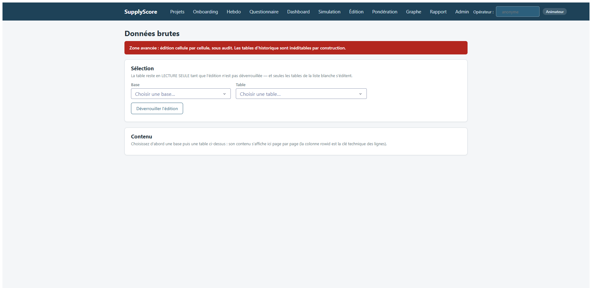

### Visual Cues
* Walk through the administrative dashboard, showing database sizes, migration versions, and backup logs.
* Point to the "Sauvegarder les bases maintenant" (Backup database now) button.
* Explain the automatic backup retention rule (20 zip archives maximum).

### Speaker Script
Let's discuss the operational hardening and administrative features of SupplyScore. Because the software runs on SQLite, it is critical to protect against write locking and file corruption, particularly if database folders are placed in cloud-synchronized folders (like OneDrive). To harden the persistence layer, the application uses WAL (Write-Ahead Logging) mode, which writes changes to a log file first, ensuring atomic commits. The `ServiceSauvegarde` class in `supplyscore/data/backup.py` handles exports and backups. When a backup is triggered, the service first executes a `PRAGMA integrity_check` on each database. If any base is malformed, the backup aborts. Otherwise, it uses the native `sqlite3.backup` API, which creates a consistent copy of the database without locking the application threads. The databases are compressed into a single zip archive. Automatic backups run every 24 hours at server startup, with a strict retention cap of 20 archives to prevent disk saturation. Finally, database schema migrations are managed via versioned functions linked to `PRAGMA user_version`, ensuring that schemas are updated safely and transactionally.

### Technical Notes
* **Code Files**: `supplyscore/data/backup.py` (`ServiceSauvegarde`) and `supplyscore/data/migrations.py`.
* **SQLite Hardening PRAGMAs**:
  ```sql
  PRAGMA journal_mode=WAL;
  PRAGMA synchronous=NORMAL;
  PRAGMA foreign_keys=OFF; -- FK checks deferred to application level for performance
  ```
* **Integrity Validation**: Runs `PRAGMA integrity_check` before copying.
* **Auto-backup trigger**: Checks the modification time (mtime) of the last zip file in `<db-dir>/backups/`. If $> 24$ hours, triggers auto-backup and purges oldest zips exceeding 20 files limit.
* **Concrete Backup and Migration Walkthrough**:
  1. *Backup Process*:
     * The coordinator requests backup.
     * Acquire lock: `self._lock.acquire()` on the DB folder registry.
     * Run `integrity_check` on `registry.sqlite`. If return is not `"ok"`, raise validation error.
     * Open target backup connection `sqlite3.connect('backups/SupplyScore_20260630_120000.db')`.
     * Call native connection method `src_conn.backup(dst_conn)` (which copies database pages transactionally).
     * Compress all databases into `SupplyScore_20260630_120000.zip`.
     * Release lock.
  2. *Schema Migrations*:
     * Read `PRAGMA user_version` on startup. If value is $1$ and software upgrade requires version $2$ (e.g., scenario tables addition):
       * Start TRANSACTION.
       * `CREATE TABLE scenarios (...);`
       * `PRAGMA user_version = 2;`
       * COMMIT.

---

## Slide 15: Explainable AI (XAI) & Score Explanation Page

### Visual Asset


### Visual Cues
* Highlight the XAI cards on the dashboard explain page.
* Point out the mathematical breakdown shown for AHP ($Ud$), indicating the weight contribution of each criterion.
* Trace the decomposition of the noisy-OR real urgency ($Ur$), displaying local vs propagated risk.

### Speaker Script
Transparency and explainability (XAI) are core pillars of the SupplyScore design system. When a coordinator sees a low adequation score or a high urgency level, they should not have to guess *why* the algorithm reached that conclusion. The `/node/<id>/explication` page provides a complete, clear breakdown of all variables. For declared urgency ($Ud$), it isolates the individual weighted contributions of each AHP criterion: $\kappa_j = w_j \cdot (s_j - 1)/8$, summing up to $Ud$ without any mathematical residual. For real urgency ($Ur$), it decomposes the noisy-OR probability calculation to show the exact risk weight ($l_m = -\omega_m \ln(1 - u_m)$) contributed by each of the six KPI blocks. Crucially, the system separates the local risk from the propagated risk, illustrating how much of the urgency is home-grown versus how much is contaminated by upstream suppliers. By showing the actual Prospect Theory curves with the node's specific variables, planners can easily understand if the mismatch is driven by unjustified panic (False Urgency) or under-reported danger (Hidden Risk).

### Technical Notes
* **UI Page**: `supplyscore/web_ui/pages/explain.py`
* **Explicability Service**: `supplyscore/services/explain.py` (`ExplainService`).
* **Equations**:
  * AHP exact linear decomposition:
    $$Ud = \sum_j \kappa_j \quad \text{where } \kappa_j = \frac{w_j(s_j - 1)}{8}$$
  * Noisy-OR log-survie additive decomposition:
    $$Ur_{local} = 1 - \exp\left( -\sum_m \ell_m \right) \quad \text{where } \ell_m = -\omega_m \ln(1 - u_m)$$
    Contribution share of KPI block $m$:
    $$c_m = \frac{\ell_m}{\sum_k \ell_k}$$
* **Concrete Numerical Example**:
  Suppose a node has $Ud_{local} = 0.5$ and the following local KPI block outputs and weights:
  * Block 1 (Time): $u_1 = 0.5$, weight $\omega_1 = 1.0$
  * Block 2 (Capacity): $u_2 = 0.3$, weight $\omega_2 = 1.5$
  * Block 3 (Risk): $u_3 = 0.2$, weight $\omega_3 = 0.8$
  * (Other blocks have $u_m = 0.0$ or are None).
  1. We compute the log-survie value $\ell_m = -\omega_m \ln(1 - u_m)$ for each block:
     * $\ell_1 = -1.0 \ln(0.5) \approx 0.6931$
     * $\ell_2 = -1.5 \ln(0.7) \approx -1.5(-0.3567) \approx 0.5350$
     * $\ell_3 = -0.8 \ln(0.8) \approx -0.8(-0.2231) \approx 0.1785$
     * $\sum \ell_m \approx 0.6931 + 0.5350 + 0.1785 = 1.4066$
  2. We calculate the aggregated local real urgency $Ur_{local}$:
     $$Ur_{local} = 1 - \exp(-1.4066) \approx 1 - 0.2450 = 0.7550$$
  3. We decompose the exact contribution share of each block:
     * Time Contribution: $\frac{0.6931}{1.4066} \approx 49.28\%$
     * Capacity Contribution: $\frac{0.5350}{1.4066} \approx 38.04\%$
     * Risk Contribution: $\frac{0.1785}{1.4066} \approx 12.68\%$
  This audit is presented on the UI to show the coordinator precisely which KPI block is causing the risk.

---

## Slide 16: Systematic Node Criticality Index (ServiceCriticite)

### Visual Asset
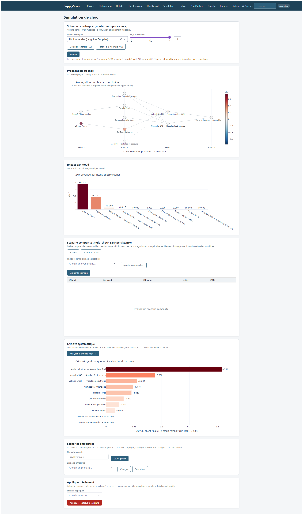

### Visual Cues
* Show the Criticality ranking table, illustrating nodes ordered from most critical to least critical.
* Explain the columns: Node name, rank, `delta_ur_final` (impact on final customers), and `delta_ur_max` (max impact on the network).
* Point to the execution stats, demonstrating sub-second calculations on the DAG.

### Speaker Script
In this sixteenth slide, we explore our Network Criticality Index, managed by `ServiceCriticite`. While what-if shock simulations allow coordinators to manually test scenarios, the Criticality service systematically answers a critical question: "which supplier node would cause the most damage to final customer delivery if it failed completely?" To compute this, the service runs a batch simulation over the entire active network. For each active node, it simulates the worst-case local disruption by setting its local real urgency to 1.0 ($Ur_{local} \to 1.0$), and runs the ascending propagation engine in memory. It then measures the resulting delta $\Delta Ur$ propagated to the final customer nodes (rank 0). Nodes are ranked based on this final customer impact. Tri-sorting is applied: by `delta_ur_final` descending, then by `delta_ur_max` descending to capture internal network stress, and finally alphabetically. This provides a clear, quantitative list of structural bottlenecks, allowing coordinators to prioritize resilience audits and buffer allocation.

### Technical Notes
* **Code File**: `supplyscore/services/criticite.py` (`ServiceCriticite`).
* **Tri-sorting Rule**:
  1. `delta_ur_final` descending.
  2. `delta_ur_max` descending.
  3. Node name ascending.
* **Choice Documented (Saturated Nodes)**: Nodes that are already at $Ur \ge 1.0$ (due to active delays or milestones failures) yield a delta of $0.0$ during the shock simulation. They are pushed to the bottom of the list. This is intentional: their risk is already realized in the baseline, so simulating a shock on them adds no new information.
* **Concrete Numerical Example**:
  Consider our 3-node serial graph from Slide 9: Node 3 (Raw Materials) $\xrightarrow{\beta_{32} = 0.9}$ Node 2 (Sub-assembly) $\xrightarrow{\beta_{21} = 0.7}$ Node 1 (Final Assembly, rank 0).
  * Project baseline state: Node 3 is `DONE` ($Ur_3=0.0$), Node 2 is `ACTIVE` ($Ur_2=0.40$), Node 1 is `ACTIVE` ($Ur_1=0.28$).
  * We simulate a complete failure on Node 2 by setting its local Ur to 1.0:
    * Predecessor Node 3 remains unaffected: $Ur_3^{shocked} = 0.0$
    * Shocked Node 2: $Ur_2^{shocked} = 1.0$
    * Propagated client Node 1:
      $$Ur_1^{shocked} = 1 - (1 - 0.0)(1 - \beta_{21} Ur_2^{shocked}) = 1 - 1.0(1 - 0.7(1.0)) = 1 - 0.30 = 0.70$$
    * Recalculated deltas:
      * Node 3 (Raw Materials): $\Delta Ur_3 = 0.0$
      * Node 2 (Sub-assembly): $\Delta Ur_2 = 1.0 - 0.40 = 0.60$
      * Node 1 (Final Assembly): $\Delta Ur_1 = 0.70 - 0.28 = 0.42$
    * Criticality entry for Node 2:
      * `delta_ur_final` (Final customer Node 1 delta) = $0.42$.
      * `delta_ur_max` (Maximum delta in network) = $0.60$.
      * `nb_impactes` (Nodes with delta $> 10^{-12}$) = 2.
    These indexes are stored and sorted to rank Node 2 in the system's criticality table.

---

## Slide 17: Prediction Calibration & Validation (CalibrationService)

### Visual Asset
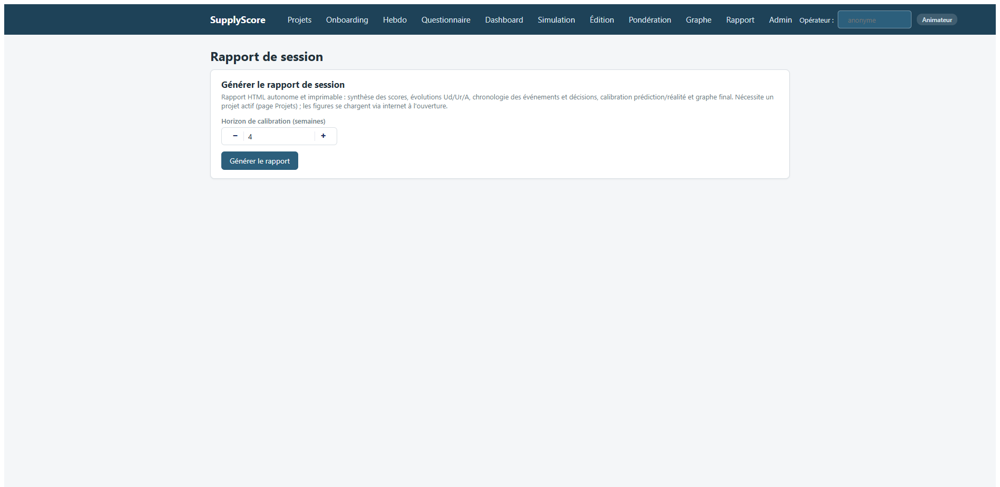

### Visual Cues
* Point to the confusion matrix and calibration indicators (precision, recall, F1-score).
* Detail the 3 historical negative outcomes: missed milestones, jalon delays, and critical events.
* Explain the observation window $[S+1, S+\text{horizon}]$.

### Speaker Script
A major challenge of deploying predictive risk models is proving their accuracy. To address this, SupplyScore includes the `CalibrationService`. This service evaluates the predictive power of the Hidden Risk index $H$. It compares the historical hidden risk $H$ recorded in week $S$ against actual negative outcomes that occurred in the subsequent window $[S+1, S+\text{horizon}]$, where the default horizon is 4 weeks. An issue is recorded if a milestone deadline falls in the window and the milestone is abandoned or delayed, if the node status becomes abandoned, or if a critical supply chain event is logged. The service constructs a confusion matrix, classifying observations as True Positives, False Positives, True Negatives, or False Negatives. From this, it computes Precision, Recall, and the F1-score. This calibration curve allows coordinators to statistically validate the model, proving that nodes flagged with high Hidden Risk are indeed statistically more likely to fail, which is essential for building user trust in the system.

### Technical Notes
* **Code File**: `supplyscore/services/calibration.py` (`CalibrationService`).
* **Database History Target**: `urgency_history` table across client databases.
* **Negative Outcomes Criteria**:
  * (a) **Missed Milestone**: deadline falls in the window and status is `ABANDONED` or `ACTIVE` and delayed.
  * (b) **Abandoned Node**: node status is currently `ABANDONED` (used as proxy).
  * (c) **Critical Event**: non-reverted event logged in the window with gravity `"critique"` or `"defaut"`.
* **Sample Size Warning**: If the number of observation points is $< 30$ (`_MIN_POINTS_CONCLUSION`), the service raises a warning indicating the sample size is too small to draw statistically significant conclusions.
* **Concrete Numerical Example**:
  Suppose a project has 4 historical observation points (Node, Week) in `urgency_history`:
  * Point 1: (Node A, Week 1): $H = 0.8$ (High Risk). A jalon is missed in Week 3 $\to$ Outcome = True.
  * Point 2: (Node B, Week 1): $H = 0.1$ (Low Risk). No milestones missed, active status $\to$ Outcome = False.
  * Point 3: (Node C, Week 2): $H = 0.6$ (High Risk). No milestones missed, active status $\to$ Outcome = False.
  * Point 4: (Node D, Week 2): $H = 0.2$ (Low Risk). Machine breakdown with critical gravity occurs in Week 3 $\to$ Outcome = True.
  Setting the predictor threshold at $H \ge 0.5$, we classify the points:
  * Point 1: Predicted positive ($H \ge 0.5$), actually positive $\to$ True Positive (TP).
  * Point 2: Predicted negative ($H < 0.5$), actually negative $\to$ True Negative (TN).
  * Point 3: Predicted positive ($H \ge 0.5$), actually negative $\to$ False Positive (FP).
  * Point 4: Predicted negative ($H < 0.5$), actually positive $\to$ False Negative (FN).
  Confusion Matrix: $TP = 1, TN = 1, FP = 1, FN = 1$.
  * Precision = $\frac{TP}{TP + FP} = \frac{1}{1 + 1} = 0.50$ (50%)
  * Recall = $\frac{TP}{TP + FN} = \frac{1}{1 + 1} = 0.50$ (50%)
  * F1-Score = $2 \cdot \frac{\text{Precision} \cdot \text{Recall}}{\text{Precision} + \text{Recall}} = 2 \cdot \frac{0.25}{1.00} = 0.50$ (50%)
  The CalibrationService aggregates these points across hundreds of operational weeks to map the final validation curve.

---

## Slide 18: Project Exports & Reporting System (ExportService)

### Visual Asset


### Visual Cues
* Point out the Excel export card on the projects dashboard.
* Describe the 12 worksheets generated in the workbook.
* Emphasize the local timezone formatting applied to all epoch timestamps.

### Speaker Script
For post-game analysis and auditing, SupplyScore features a robust reporting and export system managed by `ExportService` in `supplyscore/services/exports.py`. Rather than performing simple database dumps, the service compiles all global registry data and individual client database records into a single, structured Excel workbook containing 12 distinct worksheets. The export file name is standardized as `SupplyScore_<project-slug>_AAAAMMJJ_HHMMSS.xlsx` based on the project name and generation time. The sheets cover the project parameters, nodes, arcs, milestones, KPI snapshots, urgency histories, weekly reviews, audit logs, and decisions. Crucially, the service automatically converts all epoch timestamps to the coordinator's local timezone and formats dates as readable strings. This allows analysts to load the data directly into Excel or Python pandas to run statistical reviews and assess player decision-making.

### Technical Notes
* **Code File**: `supplyscore/services/exports.py` (`ExportService`) and `supplyscore/services/report.py`.
* **12 Worksheets**:
  1. `projet`: Project metadata (ID, name, description, t0, creation date, clock mode).
  2. `noeuds`: Active nodes, ranks, tags, current Ud/Ur/A/F/H values.
  3. `arcs`: Connective links, propagation coefficients ($\gamma, \beta$).
  4. `jalons`: All milestones, deadlines, progress, status.
  5. `historique_urgences`: Weekly chronological records of Ud/Ur/A/F/H for all nodes.
  6. `evaluations`: AHP assessment details (judgments, weights, CR, $\lambda_{\max}$).
  7. `revues`: Weekly reviews completion logs.
  8. `kpi_snapshots`: KPI snapshots histories.
  9. `evenements`: Declared events lists, parameters, impacts.
  10. `decisions`: Signed decisions.
  11. `audit_registre`: Audit log for global registry (entity_type, entity_id, field, old_value, new_value, timestamp).
  12. `audit_noeuds`: Audits logs for all nodes databases (entity_type, entity_id, field, old_value, new_value, timestamp).
* **Timezone conversion logic**: Done via Python's standard `datetime.fromtimestamp` using the local system time zone (rather than UTC), ensuring that dates match the coordinator's local clock.

---

## Slide 19: Summary / Unification: Proposed Future Integration

### Visual Asset
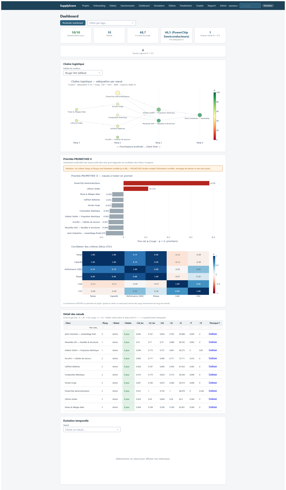

### Visual Cues
* Show the unified dashboard interface where all metrics (AHP, FBWM, PROMETHEE, MC, Propagation, Adequation) come together.
* Introduce the proposed Unified Urgency Score $US(t)$ equation.
* Explain each coefficient in the equation: $\omega_A$ (adequation), $\omega_V$ (Monte Carlo volatility), $\omega_O$ (operational metadata), $\omega_C$ (crisis buffer), $\omega_L$ (macro logistics factor).

### Speaker Script
Now that we have covered the six deep dives and the operational features, let us discuss how these components can be unified into a single, comprehensive metric for decision-makers. We propose a Unified Urgency Score, $US(t)$, which runs from 0 to 100. This score integrates the adequation score ($A(t)$), the Monte Carlo lead-time volatility ($V_{mc}$), operational metadata ($O_{meta}$, such as task critical path indicators), and subtracts crisis damping factors ($C_{crise}(t)$) and macro-logistical capacity indicators ($L_{macro}(t)$). The weights for these components are subject to an invariant constraint: their sum must equal 1.0. This score provides a single, clear indicator that combines human sentiment, physical risk, stochastic lead-time variance, and macro-environmental capacity. By displaying this unified score on the main dashboard, as shown in the screenshot, planners can quickly identify which nodes are in critical condition, which are experiencing cognitive overload, and which are under-reporting risks, allowing for immediate corrective action.

### Technical Notes
* **Proposed Equation**:
  $$US(t) = 100 \cdot \text{clip}\left(\omega_A \frac{A(t)}{100} + \omega_V V_{mc} + \omega_O O_{meta} - \omega_C C_{crise}(t) - \omega_L L_{macro}(t), 0.0, 1.0\right)$$
  where:
  * $A(t) \in [0, 100]$ is the asymmetric adequation score from Prospect Theory.
  * $V_{mc} \in [0, 1]$ is the stochastic delay risk from the Monte Carlo simulation.
  * $O_{meta} \in [0, 1]$ is the local operational complexity/critical path indicator.
  * $C_{crise}(t) \ge 0$ is a crisis damping factor (active buffering).
  * $L_{macro}(t) \ge 0$ is a macro-logistics capacity index (e.g., regional transport availability).
  * Invariant sum constraint: $\omega_A + \omega_V + \omega_O = 1.0$.
* **Purpose**: Unify all mathematical elements of the framework into a single index.
* **Dashboard Integration**: Visualized in `supplyscore/web_ui/components/figures.py` and served by `supplyscore/services/report.py`.

---

## Slide 20: Next Steps: Intelligent Pattern Detection & Autonomous Decision Agents

### Visual Asset


### Visual Cues
* Describe the transition from passive tracking to active decision guidance.
* Highlight the Pattern Detection loop (diagnosing cognitive anomalies).
* Explain the Autonomous Recommendation loop based on Markov Decision Processes (MDP).

### Speaker Script
Looking to the future, we ask: what is the next step for the SupplyScore software? We believe the goal is to transform the system from a passive urgency tracking tool into an active pattern detection and autonomous decision-guidance agent. First, we propose integrating Temporal Graph Networks (TGNs) and LSTMs to automatically detect cognitive anomalies in historical data. For instance, the system can classify coordinator behaviors, flagging a "Panicking Coordinator" who declares high urgency ($Ud \to 1.0$) for minor events, or identifying "Silent Bottlenecks" where risk is under-reported. Second, we can build an autonomous agentic recommendation loop. By formulating supply chain corrective actions (e.g., switching to backup arcs or rescheduling milestones) as a Markov Decision Process (MDP), the agent can execute sandboxed in-memory simulations of different actions. The agent will evaluate the expected future network adequation score $A(t+1)$ for each option, automatically proposing the optimal operational path to the user. This turns the tool into a true cognitive guide for supply chain resilience.

### Technical Notes
* **Paradigm Shift**: Passive Tracking $\to$ Active Pattern Classification $\to$ Autonomous Guidance Agent.
* **Statistical Patterns to Detect**:
  * *Coordinator Panic*: Frequent false urgency patterns:
    $$\Delta_{panic} = Ud - Ur \ge 0.50 \quad \text{without operational delays}$$
  * *Silent Bottleneck*: Consistently under-reported risks at critical Tier 2 nodes:
    $$\Delta_{silent} = Ur - Ud \ge 0.50 \quad \text{with active milestone slippage}$$
  * *Bullwhip Ripple*: Declared urgency spikes at client nodes propagating downstream, causing amplified stress alerts at raw material nodes.
* **Autonomous Recommendation Loop (MDP Formulation)**:
  * State Space $S$: The current network status vectors ($Ud_i, Ur_i, A_i$, inventory levels, milestone margins).
  * Action Space $A$: The set of possible corrective decisions (activate backup arc, request expediting transport, adjust milestone).
  * Transition Probability $P(s' | s, a)$: Evaluated via Monte Carlo lead-time simulation under decision overrides.
  * Reward Function $R(s, a)$: Maximizes network-wide adequation while minimizing cost penalties:
    $$R(s, a) = \sum_{i} A_i(s) - c(a)$$
    where $c(a)$ is the financial cost of action $a$.
  * Agentic execution: Leverages LLM reasoners (ReAct pattern) to call the `SupplyScoreService` facade, querying explainability logs and running in-memory simulations to select the highest-expected-reward path.

---

## Slide 21: Retrospective & Conclusion

### Visual Asset


### Visual Cues
* Summarize the role of temporal management: `SystemClock` for production, `GameClock` for serious games, and `FixedClock` for deterministic testing.
* Mention the weekly cycle (`WeeklyReview` in `weekly.py`) and how it prompts managers to keep evaluations fresh.
* Explain the what-if shock simulation (`simulate_shock`) used to stress-test the network.

### Speaker Script
To conclude this three-hour session, let's review the temporal framework and simulation capabilities of SupplyScore. In a real-world system, time is a critical variable. To handle this, the codebase implements a decoupled clock pattern. We use `SystemClock` for live production environments, `FixedClock` to freeze time for deterministic unit testing, and `GameClock` for serious games, allowing time to advance week-by-week. This weekly cycle is enforced by the `weekly.py` service, which calculates AHP coverage and flags nodes as "up-to-date", "delayed", or "missing" assessments. Finally, the framework supports robust what-if shock simulations via `simulate_shock`. This feature allows coordinators to inject a hypothetical disruption (e.g., setting a supplier's $Ur$ to 1.0) and instantly calculate the propagated delta $\Delta Ur$ across the entire network, without writing to the database. This allows teams to identify structural bottlenecks and test the resilience of their supply chains before a crisis occurs.

### Technical Notes
* **Clock Module**: `supplyscore/core/clock.py` implementing `SystemClock`, `FixedClock`, `GameClock`.
* **Weekly Review Persistence**: `weekly_reviews` table in client databases, managed by `supplyscore/services/weekly.py`.
* **Shock Simulation**: `simulate_shock` in `supplyscore/services/orchestrator.py` delegating to `PropagationEngine.simulate_shock` in `supplyscore/graph/propagation.py`.
* **Future Work**: Implementing parallel task scheduling constraints within single supplier nodes and handling cycles in the topology repository.
